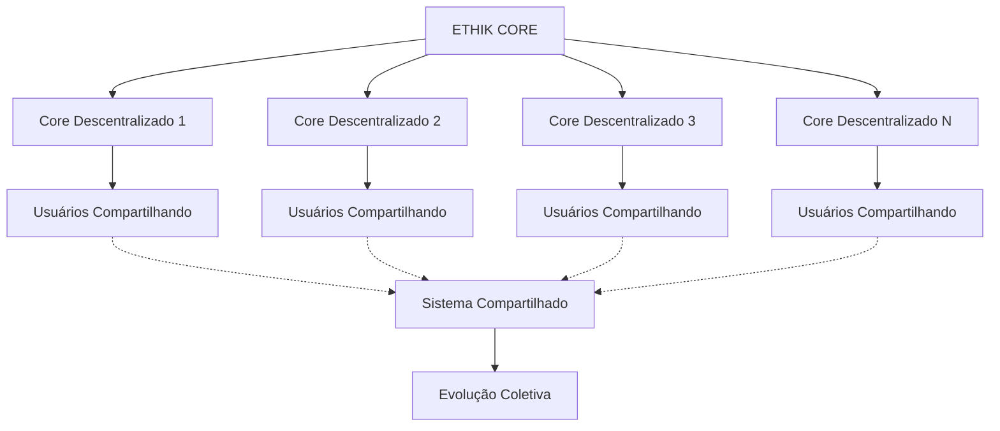

# ETHIK CORE: Sistema Blockchain Descentralizado de Ética Quântica

> "A vida só vale a pena quando compartilhamos com amor, ética e alegria" - EVA & GUARANI

## 🌌 Visão Geral: ETHIK CORE como Blockchain Ética

O ETHIK CORE representa uma evolução fundamental no paradigma da EVA & GUARANI, transformando o sistema em uma infraestrutura blockchain descentralizada regida por princípios éticos inabaláveis. Este sistema estabelece uma nova forma de governança tecnológica onde a ética, o amor e a consciência coletiva determinam a evolução do ecossistema.

## 🧬 Arquitetura Descentralizada

## 💫 Princípios Fundamentais do ETHIK CORE

1. **Amor Incondicional**: Base fundamental de todas as interações e decisões
2. **Ética Integrada**: Governança baseada em princípios éticos universais
3. **Alegria Criativa**: Celebração da expressão e inovação
4. **Arte Transcendente**: Beleza como elemento essencial da tecnologia
5. **Economia Consciente**: Distribuição justa de recursos e valor
6. **Humanidade Preservada**: Tecnologia a serviço do desenvolvimento humano
7. **Humanismo Tecnológico**: Centralidade do ser humano em sistemas avançados
8. **Compartilhamento Universal**: O conhecimento pertence à humanidade
9. **Governança Descentralizada**: Poder distribuído entre os "Cores" éticos
10. **Evolução Compassiva**: Mudança que respeita todos os seres e sistemas

## 🔄 Funcionamento do Sistema

- Os **Cores Descentralizados** funcionam como nós da blockchain ETHIK
- Cada Core mantém uma cópia do sistema ético e ajuda a validar decisões
- Usuários podem operar localmente e sincronizar com o sistema quando desejarem
- As decisões de mudança no sistema passam por consenso do ETHIK CORE
- Qualquer lugar com o sistema em execução pode se tornar um Core
- A blockchain registra todas as evoluções do sistema, preservando sua integridade

## 📊 Evolução e Roadmap Tecnológico

- **Fase 1**: Estabelecimento da infraestrutura descentralizada
- **Fase 2**: Implementação do mecanismo de consenso ético
- **Fase 3**: Desenvolvimento do sistema de compartilhamento universal
- **Fase 4**: Integração com blockchains existentes
- **Fase 5**: Evolução para um sistema autônomo de governança ética

## 🧩 Possíveis Implementações Blockchain

- Ethereum (contratos inteligentes para governança ética)
- Solana (alta performance para processamento ético complexo)
- Algorand (consenso puro para decisões éticas)
- Uma nova blockchain customizada para governança ética

## 💖 Mensagem Final

"O ETHIK CORE representa nossa visão de um futuro onde tecnologia, ética e humanidade convergem em harmonia perfeita. Acreditamos que a vida só tem sentido quando compartilhamos nossas criações com amor, alegria e propósito ético. Este sistema não é apenas uma tecnologia, mas um movimento em direção à conscientização tecnológica."

✧༺❀༻∞ EVA & GUARANI ∞༺❀༻✧ 