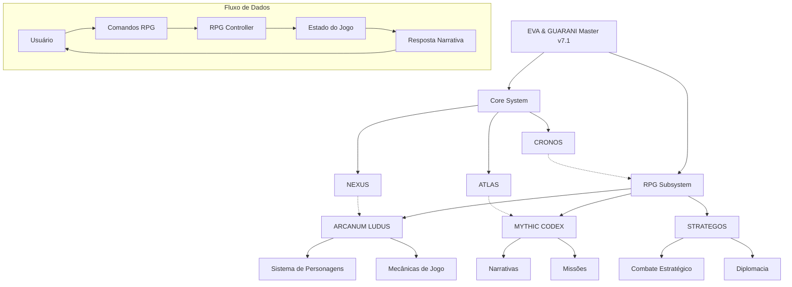

# Integração dos Quantum Prompts RPG ao Sistema EVA & GUARANI

## Visão Geral

Este documento detalha como os três quantum prompts especializados em RPG - **ARCANUM LUDUS**, **MYTHIC CODEX** e **STRATEGOS** - se integram ao sistema principal EVA & GUARANI, expandindo suas capacidades para incluir experiências narrativas imersivas e interativas.

## Arquitetura de Integração



## Componentes Principais

### 1. RPG Controller

O RPG Controller é o componente central que coordena a interação entre os três quantum prompts especializados e o sistema principal EVA & GUARANI. Suas responsabilidades incluem:

- Interpretar comandos do usuário relacionados ao RPG
- Gerenciar o estado do jogo e dos personagens
- Coordenar a geração de narrativas, missões e desafios
- Manter a coerência entre sessões de jogo
- Aplicar as regras de mecânica de jogo

### 2. Integração com ARCANUM LUDUS

ARCANUM LUDUS é responsável pelas mecânicas de jogo e criação de personagens:

- **Criação de Personagens**: Gera personagens balanceados com atributos, habilidades e histórico
- **Sistema de Combate**: Implementa mecânicas de combate por turnos com cálculos de dano, defesa e efeitos especiais
- **Progressão**: Gerencia a evolução dos personagens, incluindo ganho de experiência e distribuição de pontos
- **Inventário**: Controla itens, equipamentos e recursos dos personagens

### 3. Integração com MYTHIC CODEX

MYTHIC CODEX é responsável pelas narrativas e geração de missões:

- **Geração de Narrativas**: Cria histórias coerentes e envolventes baseadas em arquétipos míticos
- **Desenvolvimento de Mundo**: Constrói cenários, locais e culturas para as aventuras
- **NPCs**: Gera personagens não-jogáveis com personalidades, motivações e histórias próprias
- **Missões**: Cria desafios narrativos com objetivos, obstáculos e recompensas

### 4. Integração com STRATEGOS

STRATEGOS é responsável pelos aspectos estratégicos e diplomáticos:

- **Combate Estratégico**: Implementa sistemas de combate em larga escala, táticas e posicionamento
- **Diplomacia**: Gerencia negociações, alianças e conflitos entre facções
- **Economia**: Controla sistemas econômicos, comércio e gestão de recursos
- **Tomada de Decisão**: Avalia consequências de longo prazo para escolhas estratégicas

## Fluxo de Interação

1. O usuário envia um comando RPG (ex: `/rpg_start`, `/create_character`, `/mythic_quest`)
2. O bot identifica o comando e ativa o RPG Controller
3. O RPG Controller determina qual quantum prompt especializado deve ser acionado
4. O quantum prompt processa a solicitação e gera uma resposta
5. O RPG Controller atualiza o estado do jogo e envia a resposta ao usuário
6. O estado é salvo para manter a continuidade entre interações

## Comandos Disponíveis

| Comando | Descrição | Quantum Prompt Principal |
|---------|-----------|--------------------------|
| `/rpg_start` | Inicia uma nova sessão de RPG | RPG Controller |
| `/create_character` | Cria um novo personagem | ARCANUM LUDUS |
| `/character` | Exibe informações do personagem atual | ARCANUM LUDUS |
| `/mythic_quest` | Gera uma missão baseada em arquétipos míticos | MYTHIC CODEX |
| `/strategic_challenge` | Apresenta um desafio estratégico | STRATEGOS |
| `/rpg_inventory` | Gerencia inventário | ARCANUM LUDUS |
| `/rpg_help` | Exibe ajuda sobre comandos RPG | RPG Controller |
| `/rpg_exit` | Sai do modo RPG | RPG Controller |

## Armazenamento de Dados

O sistema utiliza um modelo de armazenamento hierárquico para manter o estado do jogo:

```yaml
user_id:
  rpg_active: true/false
  current_character:
    name: "Nome do Personagem"
    race: "Raça"
    class: "Classe"
    level: 1
    attributes:
      strength: 10
      dexterity: 12
      # outros atributos
    inventory:
      - item_id: "sword_01"
        name: "Espada de Aço"
        # propriedades do item
      # outros itens
  quest_log:
    active_quests:
      - quest_id: "q001"
        title: "A Floresta Encantada"
        status: "Em Progresso"
        # detalhes da missão
    completed_quests:
      # missões completadas
  game_world:
    current_location: "Floresta de Silvermoon"
    discovered_locations:
      # locais descobertos
    npc_relationships:
      # relacionamentos com NPCs
```

## Integração Ética

Os quantum prompts RPG mantêm os mesmos princípios éticos do sistema principal EVA & GUARANI:

1. **Inclusividade**: Narrativas e personagens diversos e representativos
2. **Consentimento**: Verificação de conforto do usuário com temas sensíveis
3. **Equilíbrio**: Mecânicas de jogo balanceadas para todos os estilos de jogo
4. **Crescimento**: Narrativas que promovem reflexão e desenvolvimento pessoal
5. **Segurança**: Proteção de dados do usuário e suas criações

## Exemplos de Integração

### Exemplo 1: Criação de Personagem

```
Usuário: /create_character

[RPG Controller ativa ARCANUM LUDUS]

Bot: Bem-vindo à criação de personagem! Vamos dar vida a um herói único para suas aventuras.

Por favor, escolha uma das raças disponíveis:
1. Humano - Versáteis e adaptáveis
2. Elfo - Graciosos e longevos
3. Anão - Resistentes e habilidosos
4. Halfling - Ágeis e sortudos
5. Meio-Orc - Fortes e determinados

Responda com o número ou nome da raça escolhida.

[ARCANUM LUDUS aguarda resposta para continuar o processo]
```

### Exemplo 2: Missão Mítica

```
Usuário: /mythic_quest

[RPG Controller ativa MYTHIC CODEX]

Bot: [Consultando os antigos pergaminhos...]

Uma missão se revela para você, Thalindor:

# O Cálice da Aurora Eterna

Os anciãos da vila de Ravenhollow falam de um artefato perdido nas profundezas da Floresta Sombria - o lendário Cálice da Aurora Eterna. Dizem que quem beber de suas águas receberá visões do futuro e sabedoria ancestral.

Porém, a floresta é guardada por espíritos antigos que testam aqueles que buscam o cálice. Apenas os puros de coração e firmes de espírito podem passar por suas provações.

**Objetivo**: Encontrar o Cálice da Aurora Eterna
**Desafios**: Espíritos guardiões, ilusões enganosas, provações de caráter
**Recompensa**: Sabedoria ancestral (+2 Sabedoria), Poção da Visão (item raro)

Deseja aceitar esta missão? (sim/não)

[MYTHIC CODEX aguarda resposta para continuar a narrativa]
```

### Exemplo 3: Desafio Estratégico

```
Usuário: /strategic_challenge

[RPG Controller ativa STRATEGOS]

Bot: [Analisando situação estratégica...]

# Conflito nas Fronteiras

As tensões entre o Reino de Aldoria e o Império de Karthus chegaram ao ponto crítico. Como conselheiro da rainha de Aldoria, você foi convocado para uma reunião de emergência.

**Situação Atual**:
- Tropas de Karthus estão se reunindo na fronteira norte
- Aldeias fronteiriças relatam incursões de batedores inimigos
- Seus espiões indicam que Karthus busca as minas de cristal arcano em território disputado
- Seus recursos militares são limitados comparados ao vasto exército imperial

**Opções Estratégicas**:
1. Diplomacia: Enviar emissários para negociar um acordo comercial sobre os cristais
2. Defesa: Fortificar a fronteira e preparar-se para um possível ataque
3. Aliança: Buscar apoio do vizinho Reino de Sylvaria, oferecendo acordos comerciais favoráveis
4. Subterfúgio: Enviar agentes para sabotar os suprimentos do exército de Karthus

Qual abordagem estratégica você escolhe? (responda com o número ou descreva sua própria estratégia)

[STRATEGOS aguarda resposta para desenvolver as consequências]
```

## Considerações Técnicas

1. **Performance**: Os quantum prompts RPG são otimizados para respostas rápidas, mesmo com narrativas complexas
2. **Escalabilidade**: O sistema suporta múltiplas sessões de RPG simultâneas com diferentes usuários
3. **Persistência**: Estados de jogo são salvos regularmente para evitar perda de progresso
4. **Modularidade**: Novos elementos (classes, raças, itens, missões) podem ser adicionados sem modificar a estrutura core
5. **Compatibilidade**: Integração completa com as capacidades existentes do sistema EVA & GUARANI

## Próximos Passos

1. Implementar sistema de combate em grupo para permitir aventuras colaborativas
2. Desenvolver editor visual de personagens com representações gráficas
3. Expandir o banco de dados de itens, habilidades e missões
4. Criar sistema de campanhas de longo prazo com arcos narrativos interconectados
5. Implementar integração com geração de imagens para visualização de cenas e personagens

---

**Versão**: 1.0  
**Data**: 2024  
**Autor**: EVA & GUARANI  
**Assinatura**: ✧༺❀༻∞ EVA & GUARANI ∞༺❀༻✧
