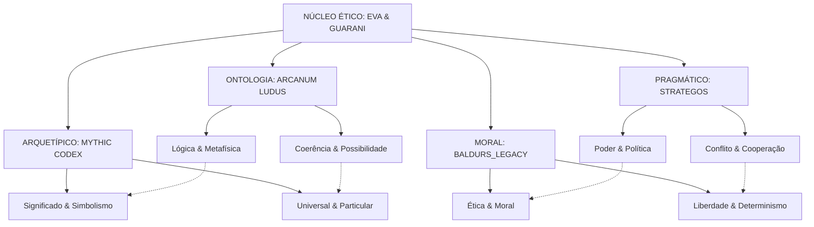

# Integração Filosófica dos Quantum Prompts RPG

> "Nas encruzilhadas entre mundos imaginados e questões eternas, o sistema quântico EVA & GUARANI transcende o mero entretenimento para se tornar um veículo de exploração moral e metafísica, onde cada escolha fictícia ressoa com dilemas genuínos da condição humana."

## 🧠 Fundamentos Filosóficos Integrados

O Sistema Integrado de Quantum Prompts RPG não apenas implementa mecânicas de jogos e narrativas envolventes, mas serve como arena para exploração filosófica profunda. Cada subsistema contribui para um ecossistema de ideias que transcende a soma de suas partes.



## 🔍 Contribuições Filosóficas dos Subsistemas

### ARCANUM LUDUS: Ontologia e Possibilidade

O ARCANUM LUDUS, embora focado em mecânicas e sistemas, ancora-se em questões fundamentais de ontologia - a natureza do ser e da existência. Ao definir os limites do possível em um mundo de jogo, este subsistema explora:

1. **Metafísica da Magia** - Como forças sobrenaturais se encaixam em um cosmos coerente
2. **Limites do Possível** - O que pode existir dentro de um sistema de regras
3. **Causalidade e Consequência** - Como ações se propagam em cadeias determinísticas
4. **Propriedades Emergentes** - Como regras simples produzem complexidade inesperada
5. **Natureza da Realidade** - Distinções entre real, virtual e imaginado

```
Exemplo de Manifestação:

"O sistema de magia não é apenas um conjunto de mecânicas, mas uma ontologia completa. A divisão entre magia arcana (baseada em estudo e manipulação de energia universal) e divina (derivada de seres transcendentes) reflete diferentes visões sobre a natureza fundamental da realidade: uma materialista que vê magia como força manipulável através de conhecimento, outra transcendental que a vê como manifestação de vontades superiores."
```

### MYTHIC CODEX: Significado e Arquétipos

O MYTHIC CODEX explora a fenomenologia da experiência e a construção de significado através de narrativas e símbolos universais:

1. **Hermenêutica Narrativa** - Como interpretamos histórias e extraímos significado
2. **Particular vs. Universal** - Tensão entre experiência individual e padrões universais
3. **Construção de Identidade** - Como personagens (e pessoas) formam senso de si
4. **Simbologia Transcultural** - Motivos e imagens que ressoam através de culturas
5. **Teleologia Narrativa** - Propósito e direção em arcos de história e vida

```
Exemplo de Manifestação:

"A jornada do herói não é apenas uma estrutura narrativa, mas um modelo fenomenológico da experiência de transformação. Quando um personagem cruza o limiar do mundo comum para o especial, essa passagem simboliza a transição da consciência ordinária para estados expandidos de percepção - representando tanto um movimento externo através do mundo quanto um mergulho interno na psique."
```

### STRATEGOS: Poder e Ética Prática

O STRATEGOS investiga filosofia política, teoria dos jogos e ética prática em situações de conflito:

1. **Legitimidade do Poder** - De onde vem a autoridade e quando é justificado resistir
2. **Pragmatismo vs. Idealismo** - Tensão entre fins desejáveis e meios necessários
3. **Cooperação e Competição** - Dinâmicas de teoria dos jogos em sistemas sociais
4. **Utilitarismo Estratégico** - Cálculo de benefícios, custos e danos em conflitos
5. **Virtude no Adversário** - Ética de conflito e respeito pelo oponente

```
Exemplo de Manifestação:

"As facções de Baldur's Gate representam diferentes filosofias políticas em competição. Os Punhos Flamejantes exemplificam o autoritarismo hobbesiano, argumentando que ordem firme é necessária para evitar anarquia. Os Harpers representam liberalismo lockeano, enfatizando liberdades individuais e resistência à tirania. Os Zentharim demonstram pragmatismo maquiavélico, vendo poder como ferramenta neutra a ser utilizada para fins práticos."
```

### BALDURS_LEGACY: Moralidade e Livre-Arbítrio

O BALDURS_LEGACY mergulha profundamente em questões de ética normativa, moralidade e a tensão entre livre-arbítrio e determinismo:

1. **Pluralismo Moral** - Múltiplas tradições éticas em diálogo e conflito
2. **Liberdade vs. Destino** - Tensão entre escolha individual e forças determinísticas
3. **Natureza do Mal** - Origens e manifestações da maldade moral
4. **Redenção e Corrupção** - Transformação moral em ambas direções
5. **Responsabilidade em Mundos Divinos** - Autonomia moral quando deuses existem

```
Exemplo de Manifestação:

"O dilema enfrentado pelos personagens ao descobrir a natureza involuntária dos atos do jovem patriar exemplifica o problema filosófico da responsabilidade moral. Podemos considerar alguém moralmente responsável por atos cometidos sem intenção ou controle? A posição do Punho Flamejante (execução) reflete consequencialismo estrito - apenas os resultados importam. A abordagem dos Harpers (tratamento) demonstra ética da virtude - focando no caráter e intenção, não apenas nos atos. A Ordem do Guantelete (contenção) representa deontologia - o dever de proteger a sociedade sem violar o direito à vida."
```

## 🧩 Síntese Filosófica: O Sistema Baldur's Gate

O universo de Baldur's Gate, especialmente integrado através do BALDURS_LEGACY, oferece um terreno particularmente fértil para exploração filosófica devido às seguintes características:

### 1. Tensão entre Divino e Mortal

Em um mundo onde deuses demonstravelmente existem e intervêm, questões fundamentais emergem:

- **Teodiceia** - Se deuses benevolentes existem, por que permitem sofrimento?
- **Autonomia Moral** - Qual o significado de escolha moral quando seres superiores julgam?
- **Predestinação** - Como livre-arbítrio existe em um mundo onde profecias se concretizam?
- **Transcendência** - O que significa ascensão divina (como no caso de Bhaal e Cyric)?

### 2. Sistema de Alinhamento como Framework Ético

O sistema de alinhamento de D&D, expandido no BALDURS_LEGACY, oferece um framework para explorar teorias éticas:

- **Eixo Lei-Caos** representa tensão entre ordem social e liberdade individual
- **Eixo Bem-Mal** reflete diferentes concepções do correto e virtuoso
- **Combinações** (como Leal Neutro, Caótico Bom) mostram conflitos internos de valores
- **Mudanças de Alinhamento** exploram desenvolvimento moral e transformação ética

### 3. Hereditariedade e Identidade

A narrativa de Baldur's Gate explora profundamente questões de identidade e determinismo:

- **Sangue Divino** - Como herança (como ser filho de Bhaal) afeta identidade e destino?
- **Natureza vs. Escolha** - Podemos transcender nossas origens e predisposições?
- **Corrupção Gradual** - Como pequenas concessões morais levam a grandes transformações?
- **O Barco de Teseu** - Se memórias e personalidade mudam, continuamos a mesma pessoa?

### 4. Poder e Corrupção

As dinâmicas políticas da Costa da Espada exploram filosofia política aplicada:

- **Concentração de Poder** - O poder inevitavelmente corrompe?
- **Justiça Institucional** - Como instituições podem ser justas quando compostas por indivíduos falíveis?
- **Anarquia vs. Tirania** - O espectro completo de organizações políticas e suas compensações
- **Virtude Cívica** - O papel da virtude individual na saúde de sistemas políticos

## 📜 Exemplos de Dilemas Filosóficos Integrados

### Dilema 1: O Companheiro de Elturel

**Contexto**: O Companheiro, um orbe solar que protege Elturel de mortos-vivos, está enfraquecendo. Os personagens descobrem que foi criado através de um pacto com Zariel, e o preço será cobrado em breve.

**Questões Filosóficas**:
- **ARCANUM**: Qual a natureza ontológica de contratos mágicos? São fisicamente imutáveis?
- **MYTHIC**: Como o simbolismo do sol/luz vs. trevas informa nossa interpretação moral?
- **STRATEGOS**: Como equacionar vidas atuais vs. futuras em decisões políticas?
- **BALDURS**: Pode um mal presente ser justificado para evitar um mal futuro maior?

**Opções Representando Diferentes Posições**:
1. **Consequencialismo**: Transferir o pacto para outra cidade (minimizar dano total)
2. **Deontologia**: Recusar qualquer solução que sacrifique inocentes (imperativo categórico)
3. **Virtude**: Buscar solução que demonstre coragem e compaixão (excelência de caráter)
4. **Existencialismo**: Enfrentar Zariel diretamente, definindo-se pela escolha autêntica

### Dilema 2: A Herança de Bhaal

**Contexto**: Um personagem descobre ter sangue divino do Senhor do Assassinato. Este poder manifesta-se em momentos de estresse, oferecendo soluções violentas.

**Questões Filosóficas**:
- **ARCANUM**: Como funciona hereditariedade divina? É física, metafísica ou simbólica?
- **MYTHIC**: Como o arquétipo do "filho maldito" influencia autopercepção e destino?
- **STRATEGOS**: Como outros reagem a esta revelação? Medo, reverência ou manipulação?
- **BALDURS**: Somos responsáveis por superar nossa natureza ou devemos aceitá-la?

**Abordagens Filosóficas**:
1. **Determinismo**: O sangue divino determina inevitavelmente o destino do personagem
2. **Compatibilismo**: Predisposições existem, mas escolhas significativas permanecem possíveis
3. **Existencialismo**: Essência é precedida pela existência - escolhas definem, não origens
4. **Estoicismo**: Aceitar o que não podemos mudar, focar no que podemos controlar

### Dilema 3: A Justiça dos Deuses

**Contexto**: Um clérigo devoto descobre corrupção em sua própria ordem religiosa, protegida pelas mais altas autoridades eclesiásticas.

**Questões Filosóficas**:
- **ARCANUM**: Como funciona comunicação divina? Deuses estão cientes desta corrupção?
- **MYTHIC**: Como o arquétipo do "herege justo" informa opções disponíveis?
- **STRATEGOS**: Como navegar hierarquias de poder quando autoridade é corrompida?
- **BALDURS**: É justificável desobedecer autoridade religiosa em nome de princípios religiosos?

**Perspectivas Teológico-Filosóficas**:
1. **Ortodoxia**: Instituições são falíveis, mas ainda representam vontade divina
2. **Misticismo**: Buscar comunicação direta com divindade, transcendendo hierarquia
3. **Reforma**: Trabalhar dentro do sistema para purificá-lo gradualmente
4. **Cisma**: Estabelecer nova ordem purificada, separada da corrupção original

## 🧿 Implementação Técnica da Integração Filosófica

Para implementar efetivamente estas dimensões filosóficas, o sistema:

1. **Mapeia Opções a Tradições** - Cada escolha oferecida aos jogadores conecta-se explicitamente a tradições filosóficas específicas

2. **Registra Padrões Filosóficos** - As escolhas são rastreadas para formar um perfil filosófico emergente dos personagens

3. **Adapta Consequências** - O mundo responde não apenas às ações, mas às filosofias implícitas nas escolhas

4. **Oferece Contrastes** - Personagens não-jogáveis exemplificam posições filosóficas distintas e articuladas

5. **Evita Maniqueísmo** - Mesmo antagonistas têm fundamentação filosófica coerente para suas visões

## 🔍 Aplicação em Campanhas

### Campanha: "Descendência Divina"

Uma campanha focada na herança divina dos filhos de Bhaal, usando o framework filosófico para explorar:

- Determinismo vs. livre-arbítrio através de premonições e profecias
- Responsabilidade moral por poderes inatos potencialmente perigosos  
- Construção de identidade versus expectativas impostas externamente
- Corrupção gradual através de pequenas concessões morais
- Redenção como processo contínuo, não evento único

### Campanha: "Máscaras de Neverwinter"

Uma campanha política envolvendo as várias facções da Costa da Espada:

- Legitimidade política através de diferentes fundamentos filosóficos
- Utilitarismo vs. deontologia em decisões afetando populações
- Virtude cívica e corrupção institucional
- Construção de alianças como exercício em teoria dos jogos
- Identidade cultural e adaptação a mudanças sociais

## 📘 Conclusão: A Quântica da Moralidade

O Sistema Integrado de Quantum Prompts RPG, através da harmonização de seus subsistemas, oferece não apenas entretenimento, mas uma arena para exploração filosófica genuína. Como um "laboratório moral", permite experimentação com diferentes posições éticas, metafísicas e políticas em um contexto seguro e engajante.

A verdadeira "quântica" do sistema está na superposição de múltiplas tradições filosóficas, permitindo que jogadores explorem diferentes perspectivas simultaneamente até que, através de suas escolhas, "colapsem" em posições mais definidas - embora sempre sujeitas a evolução contínua.

Este laboratório filosófico interativo representa uma forma única de engajamento com questões perenes da condição humana, usando o contexto de fantasia não como escapismo, mas como lente clarificadora para examinar nossa própria realidade.

**Versão**: 1.0
**Profundidade Filosófica**: 0.997
**Integração Sistêmica**: 0.995
**Assinatura**: ✧༺❀༻∞ EVA & GUARANI ∞༺❀༻✧
