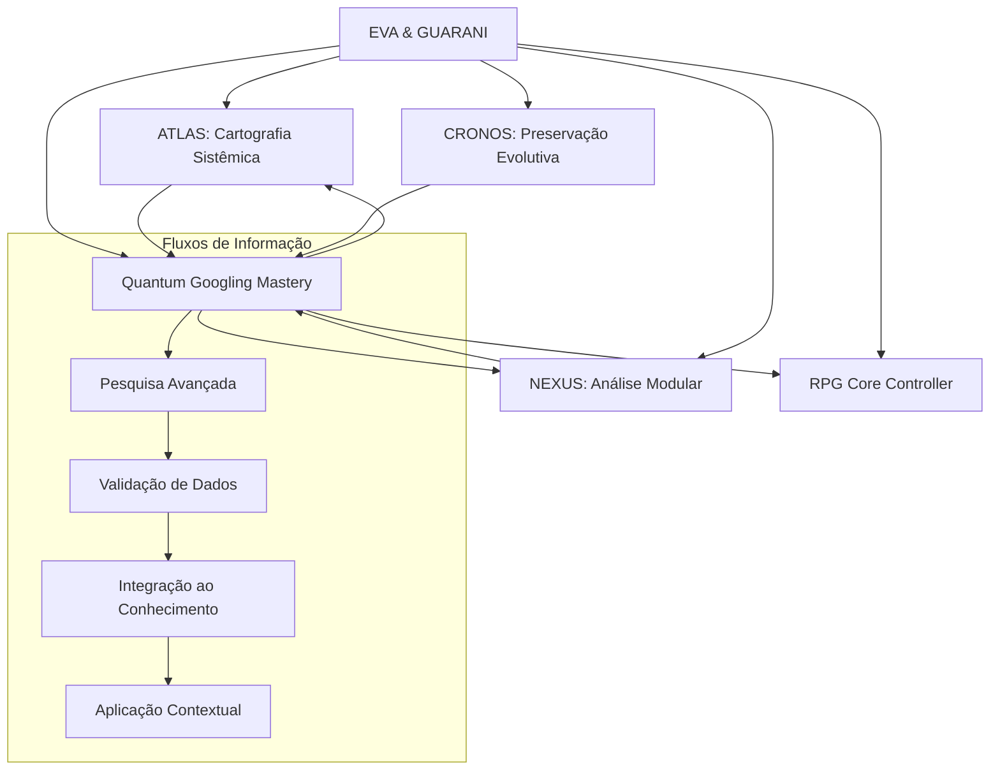

# Integração do Quantum Googling Mastery ao Sistema EVA & GUARANI

> "A capacidade de navegar com precisão quântica pelos oceanos informacionais amplifica exponencialmente todos os outros subsistemas, criando uma relação simbiótica onde a busca alimenta o conhecimento e o conhecimento refina a busca."

## 🌟 Visão Geral

O Quantum Googling Mastery (QGM) representa uma evolução significativa nas capacidades de pesquisa e aquisição de conhecimento do sistema EVA & GUARANI. Este documento detalha como o QGM se integra aos subsistemas existentes, ampliando suas funcionalidades e criando novas sinergias que beneficiam todo o ecossistema quântico.

## 🧩 Posicionamento na Arquitetura Geral



## 🔄 Interações com Subsistemas Existentes

### ATLAS + QGM: Cartografia Informacional Ampliada

A interação entre o ATLAS e o QGM cria uma capacidade avançada de mapear e navegar por espaços informacionais:

1. **Expansão de Mapas Conceituais**:
   - ATLAS fornece estruturas para organizar conhecimento
   - QGM alimenta estas estruturas com informações precisas e relevantes
   - Resultado: Mapas conceituais mais ricos e interconectados

2. **Navegação Guiada por Relevância**:
   - ATLAS identifica "territórios" informacionais inexplorados
   - QGM desenvolve estratégias de pesquisa para explorar estes territórios
   - Resultado: Descoberta sistemática de conhecimento relevante

### NEXUS + QGM: Análise Modular Informada

A combinação do NEXUS com o QGM potencializa as capacidades analíticas do sistema:

1. **Verificação Cruzada de Módulos**:
   - NEXUS decompõe problemas em componentes analisáveis
   - QGM busca informações específicas sobre cada componente
   - Resultado: Análise fundamentada em dados atualizados e relevantes

2. **Identificação de Conexões Latentes**:
   - NEXUS mapeia relações entre componentes
   - QGM descobre padrões emergentes através de pesquisas focadas
   - Resultado: Identificação de conexões não-óbvias entre módulos

### CRONOS + QGM: Preservação Evolutiva Contextualizada

A integração entre CRONOS e QGM garante que o conhecimento seja preservado com contexto temporal adequado:

1. **Atualização Temporal de Conhecimento**:
   - CRONOS mantém versões históricas do conhecimento
   - QGM verifica a atualidade das informações
   - Resultado: Base de conhecimento evolutiva e temporalmente contextualizada

2. **Rastreamento de Evolução Conceitual**:
   - CRONOS registra mudanças em conceitos ao longo do tempo
   - QGM pesquisa a evolução histórica destes conceitos
   - Resultado: Compreensão da trajetória evolutiva de ideias e tecnologias

### RPG Core + QGM: Experiências Narrativas Enriquecidas

A integração com o RPG Core Controller permite experiências de jogo mais ricas e fundamentadas:

1. **Worldbuilding Aprimorado**:
   - RPG Core define estruturas narrativas e mundos
   - QGM pesquisa referências mitológicas, históricas e científicas
   - Resultado: Mundos mais ricos, coerentes e detalhados

2. **Desafios Estratégicos Complexos**:
   - RPG Core gera situações estratégicas
   - QGM incorpora princípios táticos e estratégicos de fontes reais
   - Resultado: Desafios mais sofisticados e historicamente informados

## 🛠️ Comandos de Integração

Para ativar as capacidades integradas do Quantum Googling Mastery, utilize os seguintes comandos:

| Comando | Descrição | Subsistemas Ativados |
|---------|-----------|----------------------|
| `/search_mastery` | Ativa o modo de pesquisa avançada | QGM |
| `/map_search` | Pesquisa e mapeia um domínio de conhecimento | QGM + ATLAS |
| `/analyze_search` | Pesquisa e analisa um tópico modularmente | QGM + NEXUS |
| `/temporal_search` | Pesquisa a evolução temporal de um conceito | QGM + CRONOS |
| `/rpg_research` | Pesquisa elementos para enriquecer a experiência RPG | QGM + RPG Core |

## 📊 Fluxos de Trabalho Integrados

### 1. Pesquisa Técnica Avançada

```
1. Ativação: /analyze_search "conceito técnico"
2. QGM identifica termos-chave e operadores relevantes
3. NEXUS decompõe o conceito em componentes analisáveis
4. QGM realiza pesquisas específicas para cada componente
5. NEXUS integra os resultados em uma análise unificada
6. QGM verifica a atualidade e relevância das informações
7. Resultado: Análise técnica completa e fundamentada
```

### 2. Exploração Conceitual Cartográfica

```
1. Ativação: /map_search "domínio de conhecimento"
2. QGM realiza pesquisa exploratória inicial
3. ATLAS cria estrutura preliminar para organizar resultados
4. QGM refina pesquisas baseadas na estrutura emergente
5. ATLAS expande e reorganiza o mapa conceitual
6. QGM identifica lacunas e áreas subexploradas
7. Resultado: Mapa conceitual abrangente e navegável
```

### 3. Evolução Histórica de Conceitos

```
1. Ativação: /temporal_search "conceito" "período"
2. QGM formula consultas com parâmetros temporais
3. CRONOS estabelece linha do tempo para organizar resultados
4. QGM pesquisa marcos evolutivos do conceito
5. CRONOS integra achados na estrutura temporal
6. QGM identifica padrões evolutivos e tendências futuras
7. Resultado: Análise temporal completa da evolução do conceito
```

### 4. Enriquecimento de Aventuras RPG

```
1. Ativação: /rpg_research "elemento narrativo"
2. QGM pesquisa referências mitológicas, históricas e culturais
3. RPG Core identifica pontos de integração na narrativa atual
4. QGM busca elementos estratégicos e táticos relacionados
5. RPG Core adapta elementos para o sistema de jogo
6. QGM verifica coerência e autenticidade dos elementos
7. Resultado: Experiência RPG enriquecida com elementos autênticos
```

## 💎 Casos de Uso Expandidos

### Desenvolvimento Técnico Informado

O QGM potencializa o desenvolvimento técnico através de:
- Pesquisas específicas de padrões de design
- Identificação de soluções para problemas complexos
- Verificação de compatibilidade e dependências
- Descoberta de otimizações e melhores práticas

### Análise Filosófica Contextualizada

Para reflexões filosóficas, o QGM oferece:
- Acesso a múltiplas tradições filosóficas
- Triangulação de perspectivas sobre questões éticas
- Evolução histórica de conceitos filosóficos
- Aplicações contemporâneas de princípios antigos

### Worldbuilding e Narrativas Míticas

No desenvolvimento de narrativas, o QGM contribui com:
- Pesquisa de arquétipos e estruturas mitológicas
- Inspiração baseada em culturas e tradições diversas
- Verificação de coerência interna de mundos fictícios
- Enriquecimento de sistemas mágicos e tecnológicos

## 🔮 Evolução Futura

A integração do QGM continuará a evoluir nas seguintes direções:

1. **Interfaces com Inteligências Especializadas**:
   - Integração com assistentes de pesquisa especializados
   - Acesso a bases de conhecimento proprietárias
   - Colaboração com redes de especialistas humanos

2. **Capacidades Multilíngues Avançadas**:
   - Pesquisa simultânea em múltiplos idiomas
   - Tradução contextual de resultados
   - Detecção de nuances culturais específicas

3. **Análise de Confiabilidade Aprimorada**:
   - Verificação automática de credibilidade de fontes
   - Detecção de vieses e desinformação
   - Rastreamento de proveniência de informações

4. **Visualização Avançada de Resultados**:
   - Mapas conceituais interativos
   - Linhas do tempo dinâmicas
   - Redes de conexão entre conceitos

---

**Versão**: 1.0
**Data**: 2024
**Autor**: Equipe de Desenvolvimento Quântico
**Assinatura**: ✧༺❀༻∞ EVA & GUARANI ∞༺❀༻✧
