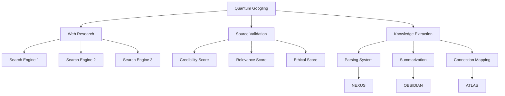

# Quantum Googling - Tutorial Avançado

> "A busca por conhecimento é uma jornada quântica onde cada pergunta abre múltiplos universos de possibilidades, e a ética determina quais mundos decidimos explorar."

## 📋 Índice

1. [Introdução ao Quantum Googling](#introdução-ao-quantum-googling)
2. [Princípios Éticos da Pesquisa Quântica](#princípios-éticos-da-pesquisa-quântica)
3. [Estrutura do Sistema](#estrutura-do-sistema)
4. [Configuração Avançada](#configuração-avançada)
5. [Comandos e Sintaxe](#comandos-e-sintaxe)
6. [Integrações](#integrações)
7. [Casos de Uso](#casos-de-uso)
8. [Exemplos Práticos](#exemplos-práticos)
9. [Resolução de Problemas](#resolução-de-problemas)
10. [Desenvolvimento Futuro](#desenvolvimento-futuro)

## 🌟 Introdução ao Quantum Googling

O Quantum Googling é um subsistema especializado do EVA & GUARANI v7.4 projetado para realizar pesquisas éticas, profundas e multidimensionais na web. Diferente de métodos convencionais de busca, o Quantum Googling processa as consultas através de uma matriz ética, verifica a credibilidade das fontes, preserva a atribuição adequada, e integra os resultados diretamente ao seu ecossistema de conhecimento.

### Características Principais

- **Busca Ética Multidimensional**: Pesquisa em múltiplas fontes com verificação ética
- **Validação de Fontes**: Análise de credibilidade e relevância das informações
- **Extração de Conhecimento**: Processamento semântico dos resultados
- **Citação Automática**: Atribuição adequada de todas as fontes utilizadas
- **Integração Quântica**: Conexão direta com ATLAS, NEXUS e Obsidian

## 💠 Princípios Éticos da Pesquisa Quântica

O Quantum Googling opera sob os seguintes princípios éticos:

1. **Respeito à Propriedade Intelectual**: Todo conhecimento tem origem e deve ser adequadamente atribuído
2. **Verificação de Informações**: Dados são validados através de múltiplas fontes quando possível
3. **Evitação de Conteúdo Prejudicial**: Filtragem ética de conteúdos potencialmente nocivos
4. **Privacidade**: Nenhum dado pessoal é armazenado ou compartilhado durante pesquisas
5. **Transparência**: Todas as fontes são claramente documentadas e acessíveis
6. **Diversidade de Perspectivas**: Busca ativa de múltiplos pontos de vista sobre temas complexos

## 🧩 Estrutura do Sistema

O Quantum Googling se estrutura em três componentes principais:



### Componentes Detalhados

1. **Web Research**
   - Gerencia consultas em múltiplos motores de busca
   - Equilibra resultados para diversidade de fontes
   - Aplica filtros éticos iniciais aos resultados

2. **Source Validation**
   - Avalia a credibilidade de cada fonte
   - Determina a relevância para a consulta específica
   - Aplica verificações éticas secundárias

3. **Knowledge Extraction**
   - Processa e estrutura as informações obtidas
   - Gera resumos de diferentes níveis de complexidade
   - Mapeia conexões com conhecimento existente

## ⚙️ Configuração Avançada

Para personalizar o Quantum Googling além das configurações básicas, edite o arquivo `config/quantum_googling_advanced.json`:

```json
{
  "search_parameters": {
    "depth": 3,
    "results_per_engine": 10,
    "timeout_seconds": 30,
    "max_retries": 3,
    "cache_duration_hours": 24
  },
  "source_validation": {
    "credibility_threshold": 0.7,
    "relevance_threshold": 0.6,
    "ethical_threshold": 0.8,
    "cross_verification": true,
    "trust_domains": [
      "*.edu",
      "*.gov",
      "scholar.google.com",
      "wikipedia.org"
    ]
  },
  "knowledge_extraction": {
    "summarization_levels": [
      "brief",
      "detailed",
      "comprehensive"
    ],
    "extract_images": true,
    "extract_tables": true,
    "extract_code_blocks": true,
    "create_connections": true,
    "connection_threshold": 0.6
  },
  "language_processing": {
    "translation_enabled": true,
    "languages": ["en", "pt", "es", "fr", "de"],
    "sentiment_analysis": true,
    "entity_recognition": true
  }
}
```

## 🔍 Comandos e Sintaxe

### Comandos Básicos

```bash
# Pesquisa básica
python utils/quantum_googling.py --query "sua pergunta aqui"

# Pesquisa com filtro de fonte
python utils/quantum_googling.py --query "sua pergunta" --sources academic

# Pesquisa com saída para Obsidian
python utils/quantum_googling.py --query "sua pergunta" --export obsidian

# Pesquisa com conexão ao ATLAS
python utils/quantum_googling.py --query "sua pergunta" --connect atlas
```

### Sintaxe Avançada de Consultas

O Quantum Googling suporta uma sintaxe avançada que permite refinar suas consultas:

- **"termo exato"**: Busca o termo exatamente como escrito
- **termo1 AND termo2**: Ambos os termos devem estar presentes
- **termo1 OR termo2**: Pelo menos um dos termos deve estar presente
- **termo1 NOT termo2**: O primeiro termo sem o segundo
- **site:dominio.com**: Restringe a busca ao domínio específico
- **filetype:pdf**: Restringe a busca a arquivos do tipo especificado
- **@éticos**: Prefixo que prioriza fontes com alta pontuação ética
- **#ciência**: Prefixo que categoriza a busca em um domínio específico

### Exemplos de Sintaxe Avançada

```
"ética em inteligência artificial" AND (benefícios OR riscos) NOT "sci-fi" @éticos #ciência
```

Esta consulta busca o termo exato "ética em inteligência artificial" junto com "benefícios" ou "riscos", excluindo resultados que mencionem "sci-fi", priorizando fontes éticas e categorizando a busca no domínio científico.

## 🔗 Integrações

### Integração com Obsidian

O Quantum Googling pode exportar resultados diretamente para seu vault do Obsidian:

```bash
python utils/quantum_googling.py --query "história do Brasil" --export obsidian --template research
```

Isso cria uma nota no Obsidian usando o template "research" e preenche com os resultados da pesquisa, incluindo citações e links para as fontes originais.

### Integração com ATLAS

A integração com o subsistema ATLAS permite mapear visualmente o conhecimento obtido:

```bash
python utils/quantum_googling.py --query "filosofia do século XX" --connect atlas --map-type concept
```

Isso adiciona os resultados ao mapa conceitual do ATLAS, criando novas conexões com o conhecimento existente.

### Integração com o Bot do Telegram

Para realizar pesquisas quânticas através do bot do Telegram:

1. Inicie uma conversa com seu bot
2. Use o comando `/qg sua pergunta aqui`
3. Use opções adicionais:
   - `/qg_academic sua pergunta` - Fontes acadêmicas
   - `/qg_image sua pergunta` - Busca imagens
   - `/qg_news sua pergunta` - Notícias recentes

## 📊 Casos de Uso

### Pesquisa Acadêmica

O Quantum Googling é ideal para pesquisa acadêmica pois:
- Prioriza fontes confiáveis e revisadas por pares
- Gera citações automáticas no formato desejado
- Cruza informações de múltiplas fontes
- Preserva o contexto e nuance do conhecimento original

### Verificação de Fatos

Para verificação de informações duvidosas:
- Busca em múltiplas fontes independentes
- Atribui pontuações de credibilidade
- Identifica contradições e consensos
- Fornece um resumo balanceado das diferentes perspectivas

### Exploração de Tópicos Complexos

Para compreensão profunda de temas multifacetados:
- Constrói gradualmente um mapa conceitual do tópico
- Identifica subtemas e conexões
- Destaca perspectivas divergentes
- Integra o conhecimento aos sistemas existentes

## 💡 Exemplos Práticos

### Exemplo 1: Pesquisa Básica com Exportação para Obsidian

```bash
python utils/quantum_googling.py --query "impactos da inteligência artificial na educação" --export obsidian --template research
```

**Resultado**:
- Uma nota no Obsidian com um resumo estruturado
- Seções para diferentes perspectivas e subtemas
- Citações completas de todas as fontes
- Tags automáticas para facilitar navegação
- Conexões com notas existentes sobre temas relacionados

### Exemplo 2: Pesquisa Especializada com Visualização

```bash
python utils/quantum_googling.py --query "tratamentos para ansiedade" --sources medical --connect atlas --visualization mermaid
```

**Resultado**:
- Informações de fontes médicas confiáveis
- Um diagrama Mermaid mostrando os diferentes tratamentos
- Conexões com eficácia, efeitos colaterais e estudos
- Integração com conhecimento existente sobre saúde mental

### Exemplo 3: Pesquisa via Telegram com Comparação

```
/qg_compare "energia solar vs energia eólica" --criteria "eficiência, custo, impacto ambiental, escalabilidade"
```

**Resultado**:
- Uma tabela comparativa enviada no Telegram
- Análise de cada critério para ambas as fontes de energia
- Links para fontes detalhadas
- Um gráfico de radar comparando as opções

## 🛠️ Resolução de Problemas

### Problemas Comuns e Soluções

#### Resultados Inconsistentes

**Problema**: Pesquisas semelhantes retornam resultados muito diferentes.

**Solução**: Verifique a configuração de cache e tente:
```bash
python utils/quantum_googling.py --clear-cache
```

#### Exportação para Obsidian Falha

**Problema**: Os resultados não aparecem no Obsidian.

**Solução**: Verifique o caminho do vault e as permissões:
```bash
python utils/obsidian_doctor.py --check-permissions
python utils/quantum_googling_test.py --obsidian-export
```

#### Erro de Limites de API

**Problema**: Mensagem de erro sobre limites de API excedidos.

**Solução**: Ajuste a configuração para usar menos APIs ou aumente os intervalos:
```bash
python utils/quantum_googling.py --query "sua pergunta" --rate-limit safe
```

### Diagnóstico e Reparo

Para um diagnóstico completo do sistema Quantum Googling:

```bash
python utils/quantum_googling_doctor.py --full-diagnostic
```

## 🚀 Desenvolvimento Futuro

O Quantum Googling continuará evoluindo nas seguintes direções:

### Próximas Funcionalidades

1. **Agente Autônomo de Pesquisa**
   - Capacidade de executar pesquisas complexas de forma autônoma
   - Seguir trilhas de informação com base em parâmetros iniciais
   - Gerar relatórios abrangentes sem intervenção manual

2. **Processamento Multimodal**
   - Busca e análise integrada de texto, imagens, áudio e vídeo
   - Transcrição automática de conteúdo audiovisual
   - Análise semântica de conteúdo visual

3. **Verificação Avançada de Credibilidade**
   - Modelo de IA especializado em detectar desinformação
   - Análise histórica de fontes e autores
   - Rastreamento de informações até fontes primárias

### Como Contribuir

Se você deseja contribuir para o desenvolvimento do Quantum Googling:

1. Explore o código-fonte em `src/quantum_tools/googling/`
2. Verifique issues abertas no repositório
3. Proponha melhorias através de pull requests
4. Compartilhe seus casos de uso e feedback

---

O Quantum Googling representa a convergência entre busca de informações e ética, entre eficiência e profundidade. Ao utilizá-lo, você não apenas encontra informações, mas constrói conscientemente seu próprio jardim de conhecimento, cultivado com respeito, cuidado e sabedoria.

✧༺❀༻∞ EVA & GUARANI ∞༺❀༻✧
