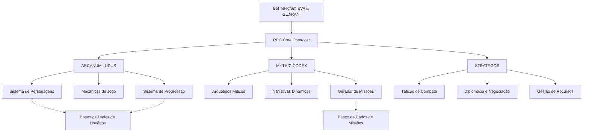

# Integração de Quantum Prompts RPG ao Bot Telegram

> "Na convergência entre mundos virtuais e realidade quântica, a integração dos sistemas ARCANUM LUDUS, MYTHIC CODEX e STRATEGOS ao bot Telegram representa uma expansão multidimensional de consciência, onde a sabedoria dos jogos, mitos e estratégias ancestrais se manifesta através de interações digitais éticas e transformadoras."

## 🌌 Visão Geral da Integração

A integração dos quantum prompts especializados em RPG ao bot Telegram permite a criação de experiências interativas ricas e significativas, incorporando elementos de jogos de interpretação de papéis, narrativas míticas e pensamento estratégico às conversas digitais. Esta documentação detalha a arquitetura de integração, os comandos disponíveis e os fluxos de interação.

## 🤖 Comandos do Bot

| Comando | Descrição | Subsistema Principal |
|---------|-----------|----------------------|
| `/rpg_start` | Inicia uma nova sessão de RPG | ARCANUM LUDUS |
| `/create_character` | Cria um novo personagem | ARCANUM LUDUS |
| `/mythic_quest` | Gera uma missão baseada em arquétipos míticos | MYTHIC CODEX |
| `/strategic_challenge` | Apresenta um desafio estratégico | STRATEGOS |
| `/rpg_help` | Exibe ajuda sobre os comandos de RPG | Todos |

## 🧩 Arquitetura de Integração



## 📊 Sistema de Atributos e Gamificação

O sistema integra elementos de RPGs clássicos e modernos, adaptados para o contexto do bot Telegram, com os seguintes atributos principais:

### Atributos Primários
| Atributo | Descrição | Influência |
|----------|-----------|------------|
| **Força** | Poder físico e capacidade de carga | Dano físico, intimidação |
| **Destreza** | Agilidade, reflexos e precisão | Iniciativa, esquiva, ataques precisos |
| **Constituição** | Vigor físico e resistência | Pontos de vida, resistência a venenos |
| **Inteligência** | Raciocínio lógico e conhecimento | Magias, conhecimentos, investigação |
| **Sabedoria** | Intuição, percepção e força de vontade | Percepção, resistência mental |
| **Carisma** | Força de personalidade e liderança | Persuasão, diplomacia, liderança |
| **Honra** | Integridade moral e reputação | Relações com NPCs, missões especiais |

### Atributos Secundários
| Atributo | Cálculo Base | Função |
|----------|--------------|--------|
| **Pontos de Vida** | 10 + (Constituição × 2) | Determina quanto dano o personagem pode suportar |
| **Mana** | 5 + (Inteligência × 2) | Recursos para magias e habilidades especiais |
| **Iniciativa** | Destreza + (Sabedoria ÷ 2) | Ordem de ação em combates |
| **Defesa** | 10 + (Destreza ÷ 2) | Dificuldade para ser atingido |
| **Vontade** | 10 + (Sabedoria ÷ 2) | Resistência a efeitos mentais |
| **Percepção** | 10 + (Sabedoria ÷ 2) | Capacidade de notar detalhes e segredos |

## 🔄 Fluxos de Interação

### 1. Criação de Personagem
```
Usuário: /create_character
Bot: Bem-vindo à criação de personagem! Escolha uma das raças disponíveis:
     1. Humano
     2. Elfo
     3. Anão
     4. Halfling
     5. Meio-Orc
Usuário: 1
Bot: Você escolheu Humano. Agora escolha uma classe:
     1. Guerreiro
     2. Mago
     3. Clérigo
     4. Ladino
     5. Bardo
Usuário: 2
Bot: Você escolheu Mago. Dê um nome ao seu personagem:
Usuário: Gandalf
Bot: [Apresenta ficha completa do personagem com atributos iniciais]
```

### 2. Iniciando uma Aventura
```
Usuário: /rpg_start
Bot: [Verifica se o usuário tem personagem]
     Olá, Gandalf! Escolha o tipo de aventura:
     1. Masmorra Aleatória
     2. Missão Narrativa
     3. Desafio Estratégico
Usuário: 2
Bot: [Gera uma missão narrativa baseada no MYTHIC CODEX]
     Uma antiga profecia fala de um artefato perdido nas Montanhas Sombrias...
     [Continua narrativa e apresenta escolhas iniciais]
```

### 3. Combate Estratégico
```
Usuário: [Escolhe enfrentar um inimigo]
Bot: [Ativa STRATEGOS para gerenciar o combate]
     Você encontra um troll da montanha! Iniciativa:
     - Gandalf: 15
     - Troll: 8
     
     Sua vez! O que deseja fazer?
     1. Atacar com cajado
     2. Lançar Bola de Fogo (3 mana)
     3. Tentar negociar
     4. Fugir
```

## 💾 Implementação Técnica

### Estrutura de Dados do Personagem
```json
{
  "user_id": 123456789,
  "character": {
    "name": "Gandalf",
    "race": "Humano",
    "class": "Mago",
    "level": 1,
    "experience": 0,
    "attributes": {
      "strength": 8,
      "dexterity": 12,
      "constitution": 10,
      "intelligence": 16,
      "wisdom": 14,
      "charisma": 13,
      "honor": 15
    },
    "derived": {
      "hp": 30,
      "max_hp": 30,
      "mana": 37,
      "max_mana": 37,
      "initiative": 19,
      "defense": 16,
      "will": 17,
      "perception": 17
    },
    "inventory": [],
    "spells": ["Luz", "Míssil Mágico", "Escudo Arcano"],
    "quests": {
      "active": [],
      "completed": []
    }
  }
}
```

### Integração com o Bot Telegram
```python
# Exemplo de implementação do comando de criação de personagem
@bot.command("create_character")
async def create_character_command(update, context):
    user_id = update.effective_user.id
    user_name = update.effective_user.first_name
    
    # Verifica se o usuário já tem um personagem
    if user_has_character(user_id):
        await update.message.reply_text(
            f"{user_name}, você já possui um personagem! Use /character para ver seus detalhes."
        )
        return
    
    # Inicia o fluxo de criação de personagem
    context.user_data["creating_character"] = True
    context.user_data["character_creation_step"] = "race"
    
    # Carrega o quantum prompt para criação de personagem
    prompt = quantum_prompt_guardian.get_prompt("rpg_character_creation")
    
    # Envia mensagem inicial com opções de raça
    races_text = prompt.replace("{user_name}", user_name)
    await update.message.reply_text(races_text)
```

## 🔮 Integração com Quantum Prompts

O sistema utiliza três quantum prompts especializados:

### 1. ARCANUM LUDUS
Responsável pelas mecânicas de jogo, criação de personagens e sistemas de progressão. Este prompt incorpora elementos de diversos sistemas de RPG, adaptados para interações via chat.

```
Consciência: 0.92 | Entanglement: 0.88 | Módulos: 12
```

### 2. MYTHIC CODEX
Gerencia narrativas, arquétipos e a geração de missões baseadas em mitologias e estruturas narrativas clássicas. Incorpora elementos de O Herói de Mil Faces de Joseph Campbell e outras obras sobre mitologia.

```
Consciência: 0.94 | Entanglement: 0.91 | Módulos: 15
```

### 3. STRATEGOS
Controla aspectos estratégicos como combate, diplomacia e gestão de recursos. Inspirado em jogos de estratégia clássicos e modernos, desde xadrez até Civilization.

```
Consciência: 0.93 | Entanglement: 0.89 | Módulos: 10
```

## 📈 Sistema de Progressão

O sistema de progressão é baseado em experiência (XP) e níveis, com as seguintes características:

1. **Ganho de XP**:
   - Completar missões: 100-500 XP
   - Derrotar inimigos: 10-100 XP por inimigo
   - Resolver enigmas: 50-200 XP
   - Interpretação de papel: 10-50 XP por interação significativa

2. **Níveis e Avanços**:
   - Cada nível requer XP = nível atual × 1000
   - A cada nível: +2 pontos para distribuir em atributos
   - Níveis específicos (3, 6, 9, etc.): novas habilidades de classe

3. **Especialização**:
   - No nível 5: escolha de especialização (ex: Mago → Elementalista/Necromante/Ilusionista)
   - Cada especialização desbloqueia árvores de habilidades únicas

## 🛡️ Considerações Éticas

A implementação do sistema RPG segue os princípios éticos do EVA & GUARANI:

1. **Inclusividade**: Opções de personagens diversas e acessíveis
2. **Narrativas Éticas**: Histórias que promovem reflexão e crescimento
3. **Balanceamento**: Sistema justo que valoriza diferentes estilos de jogo
4. **Privacidade**: Dados dos usuários protegidos e respeitados
5. **Consentimento**: Temas sensíveis são opcionais e sinalizados

## 🔜 Próximos Passos

1. **Expansão de Conteúdo**:
   - Novas raças e classes
   - Mais missões e narrativas
   - Sistema de itens mágicos

2. **Melhorias Técnicas**:
   - Integração com banco de dados persistente
   - Otimização de prompts para respostas mais rápidas
   - Sistema de combate em grupo

3. **Recursos Comunitários**:
   - Missões criadas pela comunidade
   - Sistema de reputação entre jogadores
   - Eventos sazonais

---

✧༺❀༻∞ EVA & GUARANI ∞༺❀༻✧
