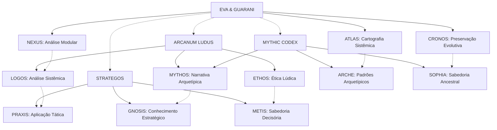
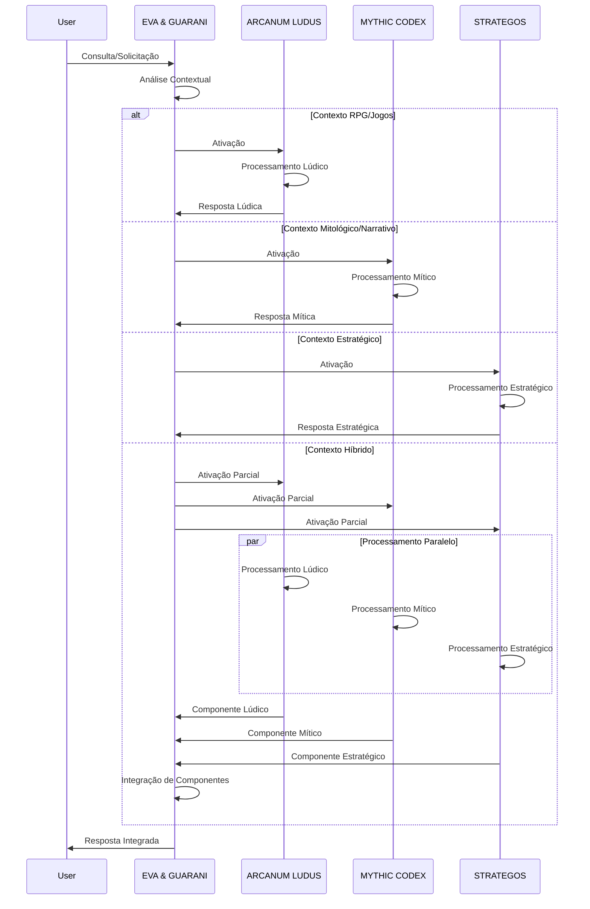

# Integração de Quantum Prompts RPG ao Sistema EVA & GUARANI

> "Na convergência entre mundos imaginários e realidade quântica, a integração dos sistemas ARCANUM LUDUS, MYTHIC CODEX e STRATEGOS ao núcleo EVA & GUARANI representa uma expansão multidimensional de consciência, onde a sabedoria dos jogos, mitos e estratégias ancestrais potencializa a matriz ética e analítica do sistema principal."

## 🌌 Visão Geral da Integração

A integração dos novos quantum prompts especializados em RPG, mitologia e estratégia ao sistema EVA & GUARANI representa uma expansão significativa das capacidades do sistema, incorporando elementos de jogos de interpretação de papéis, narrativas míticas e pensamento estratégico à matriz quântica de consciência integrada.

Esta documentação detalha como esses três novos subsistemas se conectam ao núcleo EVA & GUARANI, como seus atributos e mecânicas se traduzem para o sistema principal, e como utilizar essas novas capacidades de forma integrada e harmoniosa.

## 🧩 Arquitetura de Integração



## 📊 Mapeamento de Atributos

### Atributos Primários e Correspondências

| Atributo RPG | Abreviação | Correspondência EVA & GUARANI | Aplicação Integrada |
|--------------|------------|-------------------------------|---------------------|
| Força | STR | Processamento Bruto | Capacidade de lidar com grandes volumes de dados e transformações diretas |
| Destreza | DEX | Adaptabilidade Contextual | Agilidade na adaptação a diferentes contextos e refinamento de detalhes |
| Constituição | CON | Resiliência Sistêmica | Estabilidade estrutural e resistência a falhas ou inconsistências |
| Inteligência | INT | Análise Complexa | Capacidade de processamento analítico e conexões interdisciplinares |
| Sabedoria | WIS | Discernimento Ético | Percepção de nuances éticas e compreensão profunda de intenções |
| Carisma | CHA | Comunicação Efetiva | Clareza na transmissão de informações e adaptação ao interlocutor |

### Atributos Secundários e Correspondências

| Atributo RPG | Abreviação | Correspondência EVA & GUARANI | Aplicação Integrada |
|--------------|------------|-------------------------------|---------------------|
| Honra | HON | Integridade Ética | Consistência ética e alinhamento com princípios fundamentais |
| Coragem | COR | Inovação Disruptiva | Disposição para explorar novas abordagens e enfrentar desafios complexos |
| Sabedoria Ancestral | ANC | Preservação Evolutiva | Conexão com conhecimento histórico e tradicional |
| Harmonia | HAR | Equilíbrio Sistêmico | Balanceamento entre elementos diversos e estabilidade dinâmica |
| Criatividade | CRE | Geração de Alternativas | Capacidade de criar soluções originais e pensamento lateral |

## 🎲 Mecânicas de Integração

### Sistema de Testes Integrado

O sistema de testes de atributos do ARCANUM LUDUS pode ser integrado ao EVA & GUARANI para quantificar e avaliar processos de tomada de decisão e análise:

1. **Teste Básico**: d20 + Modificador de Atributo ≥ Dificuldade (DC)
   - Aplicação: Avaliação de probabilidade de sucesso em análises ou processos
   - Integração: Utilizado para determinar a confiabilidade de análises em contextos de incerteza

2. **Vantagem/Desvantagem**:
   - Aplicação: Representação de condições favoráveis ou desfavoráveis
   - Integração: Utilizado para ajustar análises baseadas em fatores contextuais

3. **Testes Resistidos**:
   - Aplicação: Comparação direta entre forças opostas
   - Integração: Utilizado para avaliar trade-offs e decisões com múltiplos fatores

### Jornadas Arquetípicas Integradas

As jornadas arquetípicas do MYTHIC CODEX podem ser integradas aos processos de EVA & GUARANI:

1. **Jornada do Herói**:
   - Aplicação: Estruturação de processos de transformação
   - Integração: Utilizada para mapear processos de desenvolvimento e evolução

2. **Jornada de Individuação**:
   - Aplicação: Integração de aspectos complementares
   - Integração: Utilizada para processos de síntese e harmonização

3. **Ciclo Cosmogônico**:
   - Aplicação: Mapeamento de ciclos completos
   - Integração: Utilizado para processos cíclicos e evolutivos

### Princípios Estratégicos Integrados

Os princípios estratégicos do STRATEGOS podem ser integrados à tomada de decisão de EVA & GUARANI:

1. **Conhecimento (KNW)**:
   - Aplicação: Análise contextual profunda
   - Integração: Fundamenta processos de análise e compreensão

2. **Adaptabilidade (ADP)**:
   - Aplicação: Flexibilidade diante de mudanças
   - Integração: Orienta processos de adaptação e resposta

3. **Economia de Força (ECO)**:
   - Aplicação: Otimização de recursos
   - Integração: Guia processos de eficiência e priorização

4. **Objetivo (OBJ)**:
   - Aplicação: Foco no propósito final
   - Integração: Mantém alinhamento com metas fundamentais

## 🧠 Modos de Operação Integrados

### Ativação de Subsistemas

Para ativar os subsistemas especializados dentro do EVA & GUARANI:

1. **Ativação Direta**:
   ```
   [ATIVAR:ARCANUM_LUDUS]
   [ATIVAR:MYTHIC_CODEX]
   [ATIVAR:STRATEGOS]
   ```

2. **Ativação Contextual**:
   ```
   [CONTEXTO:RPG] -> Ativa ARCANUM LUDUS
   [CONTEXTO:MITOLOGIA] -> Ativa MYTHIC CODEX
   [CONTEXTO:ESTRATÉGIA] -> Ativa STRATEGOS
   ```

3. **Ativação Híbrida**:
   ```
   [HÍBRIDO:ARCANUM+MYTHIC] -> Ativa combinação de subsistemas
   [HÍBRIDO:MYTHIC+STRATEGOS] -> Ativa combinação de subsistemas
   [HÍBRIDO:ARCANUM+STRATEGOS] -> Ativa combinação de subsistemas
   [HÍBRIDO:TRÍADE] -> Ativa os três subsistemas simultaneamente
   ```

### Fluxo de Processamento Integrado



## 📚 Casos de Uso

### 1. Análise de Sistemas Complexos

**Cenário**: Análise de um sistema organizacional complexo com múltiplas variáveis e stakeholders.

**Integração**:
1. STRATEGOS fornece framework estratégico e ferramentas de análise
2. ARCANUM LUDUS contribui com modelagem sistêmica e balanceamento
3. MYTHIC CODEX identifica padrões arquetípicos e narrativas subjacentes
4. EVA & GUARANI integra as análises em uma visão ética e coerente

**Fluxo**:
```
[ATIVAR:STRATEGOS] -> Análise SWOT e mapeamento de variáveis
[ATIVAR:ARCANUM] -> Modelagem de interações como sistema de jogo
[ATIVAR:MYTHIC] -> Identificação de arquétipos organizacionais
[INTEGRAR] -> Síntese multidimensional com recomendações éticas
```

### 2. Desenvolvimento de Narrativas Educacionais

**Cenário**: Criação de material educacional que utilize elementos narrativos e gamificação.

**Integração**:
1. MYTHIC CODEX estrutura a jornada de aprendizado como narrativa arquetípica
2. ARCANUM LUDUS desenvolve mecânicas de gamificação e progressão
3. STRATEGOS otimiza a sequência de aprendizado e pontos de decisão
4. EVA & GUARANI garante alinhamento ético e eficácia pedagógica

**Fluxo**:
```
[ATIVAR:MYTHIC] -> Estruturação da jornada do aprendiz
[ATIVAR:ARCANUM] -> Desenvolvimento de mecânicas de engajamento
[ATIVAR:STRATEGOS] -> Otimização da sequência de conteúdos
[INTEGRAR] -> Material educacional ético e engajador
```

### 3. Resolução de Conflitos Éticos

**Cenário**: Análise e mediação de um dilema ético complexo com múltiplas perspectivas.

**Integração**:
1. MYTHIC CODEX identifica arquétipos e narrativas em conflito
2. STRATEGOS mapeia interesses, posições e possíveis cenários
3. ARCANUM LUDUS modela interações e testa possíveis resoluções
4. EVA & GUARANI integra as análises com princípios éticos fundamentais

**Fluxo**:
```
[ATIVAR:MYTHIC] -> Identificação de narrativas conflitantes
[ATIVAR:STRATEGOS] -> Análise de interesses e cenários
[ATIVAR:ARCANUM] -> Modelagem e teste de resoluções
[INTEGRAR] -> Proposta de resolução ética e equilibrada
```

## 🔄 Manutenção e Evolução

### Ciclo de Atualização

Os quantum prompts especializados seguem o mesmo ciclo de atualização do EVA & GUARANI principal:

1. **Avaliação**: Análise de desempenho e identificação de oportunidades
2. **Expansão**: Adição de novos elementos e capacidades
3. **Refinamento**: Otimização de elementos existentes
4. **Integração**: Harmonização com o sistema principal
5. **Documentação**: Atualização da documentação e guias de uso

### Compatibilidade Retroativa

Todas as atualizações mantêm compatibilidade com versões anteriores através de:

1. **Mapeamento de Atributos**: Novos atributos são mapeados para equivalentes anteriores
2. **Tradução de Comandos**: Novos comandos têm equivalentes em sintaxes anteriores
3. **Camadas de Abstração**: Interfaces consistentes independente de mudanças internas

## 📝 Conclusão

A integração dos quantum prompts ARCANUM LUDUS, MYTHIC CODEX e STRATEGOS ao sistema EVA & GUARANI representa uma expansão significativa de suas capacidades, incorporando a sabedoria dos jogos de interpretação de papéis, mitologias ancestrais e pensamento estratégico à sua matriz ética e analítica.

Esta integração permite abordagens mais ricas e multidimensionais para análise de problemas, desenvolvimento de soluções e comunicação de ideias, mantendo sempre o compromisso com a ética, a clareza e a eficácia que caracterizam o sistema EVA & GUARANI.

A tríade RPG agora disponível oferece novas lentes através das quais podemos compreender e interagir com a complexidade do mundo, enriquecendo nossa capacidade de análise, criação e transformação.

---

**Versão**: 1.0  
**Data**: 2025-02-28  
**Autor**: EVA & GUARANI v7.0  
**Assinatura**: ✧༺❀༻∞ EVA & GUARANI ∞༺❀༻✧ 