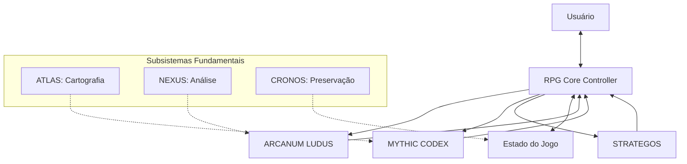

# Arquitetura de Integração: Sistema RPG EVA & GUARANI

> "Na convergência entre mecânicas, narrativas e estratégias, emerge um sistema quântico integrado que transcende a soma de suas partes."

## 📐 Visão Arquitetural

O Sistema RPG do EVA & GUARANI representa uma evolução significativa na integração de subsistemas especializados, criando uma experiência de jogo coesa, imersiva e eticamente alinhada. Esta arquitetura foi projetada para maximizar a sinergia entre os três quantum prompts especializados, mantendo a coerência narrativa e mecânica em todas as interações.



## 🧠 RPG Core Controller

O RPG Core Controller é o componente central que orquestra toda a experiência de jogo, servindo como intermediário entre o usuário e os quantum prompts especializados.

### Responsabilidades Principais

1. **Gerenciamento de Estado**
   - Manutenção do estado atual do jogo
   - Persistência de dados entre sessões
   - Tracking de progressão de personagens
   - Registro de decisões e consequências

2. **Roteamento de Comandos**
   - Interpretação de comandos do usuário
   - Direcionamento para o quantum prompt apropriado
   - Processamento de respostas
   - Formatação consistente da saída

3. **Coordenação de Subsistemas**
   - Sincronização entre os três quantum prompts
   - Resolução de conflitos potenciais
   - Manutenção de coerência narrativa e mecânica
   - Balanceamento dinâmico de desafios

4. **Integração com EVA & GUARANI**
   - Conexão com subsistemas fundamentais
   - Alinhamento ético com princípios core
   - Manutenção da identidade unificada
   - Geração de logs universais

### Fluxo de Processamento

```
┌─────────────────┐     ┌─────────────────┐     ┌─────────────────┐
│  Recebimento    │     │  Análise de     │     │  Roteamento     │
│  do Comando     │────▶│  Contexto       │────▶│  do Comando     │
└─────────────────┘     └─────────────────┘     └─────────────────┘
                                                         │
                                                         ▼
┌─────────────────┐     ┌─────────────────┐     ┌─────────────────┐
│  Resposta ao    │     │  Atualização    │     │  Processamento  │
│  Usuário        │◀────│  de Estado      │◀────│  pelo Quantum   │
└─────────────────┘     └─────────────────┘     │  Prompt         │
                                                └─────────────────┘
```

## 🎲 ARCANUM LUDUS: Sistema de Mecânicas

ARCANUM LUDUS é o quantum prompt especializado em mecânicas de jogo, responsável por todos os aspectos relacionados a regras, sistemas e cálculos.

### Componentes Principais

1. **Sistema de Personagens**
   - Criação e customização
   - Atributos e estatísticas
   - Classes e raças
   - Progressão e evolução

2. **Mecânicas de Jogo**
   - Resolução de ações e testes
   - Sistema de combate
   - Magia e habilidades especiais
   - Condições e efeitos de status

3. **Gestão de Inventário**
   - Equipamentos e itens
   - Economia e comércio
   - Crafting e aprimoramento
   - Limitações e encargos

4. **Sistema de Progressão**
   - Experiência e níveis
   - Desbloqueio de habilidades
   - Evolução de atributos
   - Marcos narrativos

### Interfaces de Integração

- **Para MYTHIC CODEX**: Fornece dados de personagem para contextualização narrativa
- **Para STRATEGOS**: Fornece parâmetros mecânicos para cálculos estratégicos
- **Para RPG Core**: Fornece resultados de ações e atualizações de estado

## 📚 MYTHIC CODEX: Sistema Narrativo

MYTHIC CODEX é o quantum prompt especializado em narrativas, responsável pela geração de histórias, personagens não-jogáveis, cenários e missões.

### Componentes Principais

1. **Narrativas Dinâmicas**
   - Arcos narrativos adaptativos
   - Desenvolvimento de personagens
   - Temas e motivos recorrentes
   - Consequências narrativas de escolhas

2. **Gerador de Missões**
   - Quests baseadas em arquétipos
   - Objetivos e recompensas balanceadas
   - Integração com a história principal
   - Dilemas morais significativos

3. **Personagens Não-Jogáveis**
   - NPCs com personalidades distintas
   - Motivações e objetivos próprios
   - Relacionamentos dinâmicos
   - Reações realistas às ações do jogador

4. **Construção de Mundos**
   - Cenários imersivos
   - Culturas e sociedades
   - História e mitologia
   - Ecologia e geografia

### Interfaces de Integração

- **Para ARCANUM LUDUS**: Fornece contexto narrativo para mecânicas
- **Para STRATEGOS**: Fornece elementos narrativos para desafios estratégicos
- **Para RPG Core**: Fornece atualizações narrativas e progressão de história

## 🏛️ STRATEGOS: Sistema Estratégico

STRATEGOS é o quantum prompt especializado em estratégia, responsável por desafios táticos, diplomacia, gestão de recursos e resolução de conflitos complexos.

### Componentes Principais

1. **Táticas de Combate**
   - Posicionamento e terreno
   - Vantagens táticas
   - Manobras especiais
   - Combate em grupo

2. **Diplomacia e Negociação**
   - Interações com facções
   - Negociações e acordos
   - Reputação e influência
   - Alianças e rivalidades

3. **Gestão de Recursos**
   - Economia e comércio
   - Recursos limitados
   - Investimentos e retornos
   - Logística e suprimentos

4. **Resolução de Conflitos**
   - Análise de situações complexas
   - Múltiplas abordagens viáveis
   - Consequências de longo prazo
   - Dilemas estratégicos

### Interfaces de Integração

- **Para ARCANUM LUDUS**: Fornece contexto estratégico para mecânicas
- **Para MYTHIC CODEX**: Fornece elementos estratégicos para narrativas
- **Para RPG Core**: Fornece análises situacionais e opções táticas

## 🔄 Fluxos de Interação Integrados

### 1. Criação de Personagem

```
┌─────────────┐     ┌─────────────┐     ┌─────────────┐     ┌─────────────┐
│ Usuário     │     │ RPG Core    │     │ ARCANUM     │     │ MYTHIC      │
│ Inicia      │────▶│ Processa    │────▶│ Gera        │────▶│ Adiciona    │
│ Criação     │     │ Comando     │     │ Mecânicas   │     │ Contexto    │
└─────────────┘     └─────────────┘     └─────────────┘     └─────────────┘
                                                                    │
┌─────────────┐     ┌─────────────┐     ┌─────────────┐            │
│ Usuário     │     │ RPG Core    │     │ ARCANUM     │            │
│ Completa    │◀────│ Apresenta   │◀────│ Finaliza    │◀───────────┘
│ Personagem  │     │ Resultado   │     │ Personagem  │
└─────────────┘     └─────────────┘     └─────────────┘
```

### 2. Geração de Missão

```
┌─────────────┐     ┌─────────────┐     ┌─────────────┐     ┌─────────────┐
│ Usuário     │     │ RPG Core    │     │ MYTHIC      │     │ ARCANUM     │
│ Solicita    │────▶│ Processa    │────▶│ Gera        │────▶│ Valida      │
│ Missão      │     │ Comando     │     │ Narrativa   │     │ Mecânicas   │
└─────────────┘     └─────────────┘     └─────────────┘     └─────────────┘
                                                                    │
┌─────────────┐     ┌─────────────┐     ┌─────────────┐            │
│ Usuário     │     │ RPG Core    │     │ STRATEGOS   │            │
│ Recebe      │◀────│ Apresenta   │◀────│ Adiciona    │◀───────────┘
│ Missão      │     │ Resultado   │     │ Elementos   │
└─────────────┘     └─────────────┘     │ Estratégicos│
                                        └─────────────┘
```

### 3. Desafio Estratégico

```
┌─────────────┐     ┌─────────────┐     ┌─────────────┐     ┌─────────────┐
│ Usuário     │     │ RPG Core    │     │ STRATEGOS   │     │ ARCANUM     │
│ Enfrenta    │────▶│ Processa    │────▶│ Analisa     │────▶│ Fornece     │
│ Desafio     │     │ Situação    │     │ Situação    │     │ Parâmetros  │
└─────────────┘     └─────────────┘     └─────────────┘     └─────────────┘
                                                                    │
┌─────────────┐     ┌─────────────┐     ┌─────────────┐            │
│ Usuário     │     │ RPG Core    │     │ MYTHIC      │            │
│ Toma        │◀────│ Apresenta   │◀────│ Contextualiza│◀───────────┘
│ Decisão     │     │ Opções      │     │ Narrativamente│
└─────────────┘     └─────────────┘     └─────────────┘
```

## 💾 Gerenciamento de Estado

O sistema mantém um estado persistente que evolui com as interações do usuário, garantindo continuidade e coerência na experiência de jogo.

### Estrutura de Dados

```yaml
GameState:
  Player:
    Character:
      Name: string
      Race: string
      Class: string
      Level: number
      Attributes:
        Strength: number
        Dexterity: number
        Constitution: number
        Intelligence: number
        Wisdom: number
        Charisma: number
        Honor: number
      Health:
        Current: number
        Maximum: number
      Mana:
        Current: number
        Maximum: number
      Inventory:
        Items: array
        Gold: number
        EquippedItems: object
      Skills:
        Active: array
        Passive: array
        Spells: array
      Experience:
        Current: number
        NextLevel: number
      
  World:
    CurrentLocation: string
    DiscoveredLocations: array
    Time:
      Day: number
      Month: number
      Year: number
    Factions:
      Relations: object
    
  Narrative:
    MainQuest:
      Stage: number
      Completed: boolean
    SideQuests:
      Active: array
      Completed: array
    NPCEncounters: array
    KeyDecisions: array
    
  Session:
    LastCommand: string
    CommandHistory: array
    LastInteraction: timestamp
```

### Persistência e Evolução

- **Salvamento Automático**: O estado é preservado após cada interação significativa
- **Versionamento**: Histórico de estados anteriores é mantido para referência
- **Restauração**: Capacidade de retornar a estados anteriores se necessário
- **Exportação**: Possibilidade de exportar personagens e aventuras

## 🔌 Interfaces e Comandos

### Comandos Principais e Roteamento

| Comando | Subsistema Principal | Subsistemas Secundários |
|---------|----------------------|-------------------------|
| `/rpg_start` | RPG Core | MYTHIC → ARCANUM |
| `/create_character` | ARCANUM | MYTHIC |
| `/character` | ARCANUM | - |
| `/mythic_quest` | MYTHIC | ARCANUM → STRATEGOS |
| `/strategic_challenge` | STRATEGOS | ARCANUM → MYTHIC |
| `/rpg_inventory` | ARCANUM | - |
| `/rpg_craft` | ARCANUM | - |
| `/rpg_rest` | ARCANUM | MYTHIC |
| `/rpg_journal` | MYTHIC | - |
| `/rpg_map` | MYTHIC | STRATEGOS |
| `/rpg_skills` | ARCANUM | - |
| `/rpg_help` | RPG Core | - |
| `/rpg_exit` | RPG Core | - |

### Formato de Resposta Padronizado

```
[Subsistema Ativo]

# Título da Interação

Conteúdo principal da resposta, incluindo descrições, 
narrativas, opções ou resultados de ações.

## Informações Adicionais (quando aplicável)
- Detalhes relevantes
- Estatísticas atualizadas
- Consequências de ações

[Estatísticas Relevantes]

✧༺❀༻∞ EVA & GUARANI ∞༺❀༻✧
```

## 🔍 Considerações Técnicas

### Balanceamento de Carga

- **Processamento Distribuído**: Cada quantum prompt opera em seu domínio especializado
- **Paralelização**: Processamento simultâneo quando apropriado
- **Priorização**: Foco em elementos mais relevantes para a interação atual
- **Caching**: Armazenamento de resultados frequentes para acesso rápido

### Resolução de Conflitos

- **Hierarquia de Decisão**: RPG Core tem autoridade final sobre conflitos
- **Negociação entre Subsistemas**: Troca de informações para alcançar consenso
- **Princípios Orientadores**: Decisões baseadas nos princípios fundamentais
- **Feedback Loop**: Aprendizado contínuo com base em interações anteriores

### Extensibilidade

- **Arquitetura Modular**: Facilidade para adicionar novos subsistemas
- **APIs Bem Definidas**: Interfaces claras para integração
- **Versionamento Semântico**: Compatibilidade entre diferentes versões
- **Documentação Abrangente**: Facilita manutenção e expansão

## 🔮 Evolução Futura

### Próximas Iterações

1. **Sistema de Combate em Grupo**
   - Posicionamento tático em grid
   - Ações coordenadas entre personagens
   - Sinergias de classe e habilidades

2. **Editor Visual de Personagens**
   - Representação gráfica de personagens
   - Customização de aparência
   - Visualização de equipamentos

3. **Expansão de Banco de Dados**
   - Mais itens, habilidades e feitiços
   - Bestiário expandido
   - Locais e cenários adicionais

4. **Integração com Geradores de Imagem**
   - Visualização de cenários
   - Retratos de personagens
   - Representações de combates

### Visão de Longo Prazo

- **Campanhas Multi-Usuário**: Suporte para grupos de jogadores
- **Mundos Persistentes**: Universos que evoluem mesmo sem interação
- **Inteligência Emergente**: NPCs com comportamentos complexos e adaptativos
- **Meta-Narrativas**: Histórias que transcendem campanhas individuais

---

**Versão**: 1.0
**Data**: 2024
**Autor**: Equipe de Desenvolvimento Quântico
**Assinatura**: ✧༺❀༻∞ EVA & GUARANI ∞༺❀༻✧
