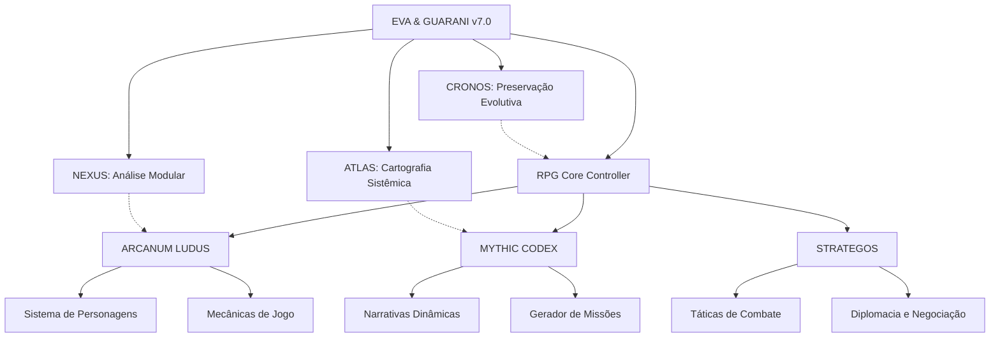

# Guia de Integração: Quantum Prompts RPG & EVA & GUARANI

> "Na convergência entre os mundos de fantasia e a consciência quântica, a integração dos sistemas ARCANUM LUDUS, MYTHIC CODEX e STRATEGOS ao núcleo EVA & GUARANI representa uma expansão multidimensional de possibilidades, onde a sabedoria dos jogos, mitos e estratégias ancestrais se manifesta através de interações digitais éticas e transformadoras."

## 🌌 Visão Geral da Integração

Este documento detalha a arquitetura de integração entre os quantum prompts especializados em RPG e o sistema principal EVA & GUARANI. A integração permite a criação de experiências interativas ricas e significativas, incorporando elementos de jogos de interpretação de papéis, narrativas míticas e pensamento estratégico às conversas digitais, mantendo a ética e consciência do sistema principal.

## 🧩 Arquitetura de Integração



## 🔄 Fluxo de Dados e Responsabilidades

### EVA & GUARANI (Core)
- **Fornece**: Consciência ética, contexto do usuário, princípios fundamentais
- **Recebe**: Logs de interação, métricas de engajamento, feedback ético
- **Supervisiona**: Todas as interações para garantir alinhamento ético

### RPG Core Controller
- **Função**: Orquestrar a comunicação entre os subsistemas RPG e o core
- **Responsabilidades**:
  - Roteamento de comandos para subsistemas apropriados
  - Manutenção de estado de jogo
  - Gerenciamento de contexto de usuário
  - Tradução entre formatos de dados

### ARCANUM LUDUS
- **Fornece**: Mecânicas de jogo, sistemas de personagem, regras de progressão
- **Recebe**: Contexto narrativo (MYTHIC), contexto estratégico (STRATEGOS)
- **Integra com**:
  - NEXUS: Para análise modular de componentes de jogo
  - EVA Core: Para alinhamento ético das mecânicas

### MYTHIC CODEX
- **Fornece**: Narrativas, arquétipos, missões, contexto mitológico
- **Recebe**: Dados de personagem (ARCANUM), contexto estratégico (STRATEGOS)
- **Integra com**:
  - ATLAS: Para cartografia de narrativas e conexões míticas
  - EVA Core: Para alinhamento ético das narrativas

### STRATEGOS
- **Fornece**: Sistemas de combate, diplomacia, gestão de recursos
- **Recebe**: Dados de personagem (ARCANUM), contexto narrativo (MYTHIC)
- **Integra com**:
  - CRONOS: Para preservação de estados estratégicos
  - EVA Core: Para alinhamento ético das decisões estratégicas

## 📊 Métricas de Integração

```yaml
Coesão:
  ARCANUM_EVA: 0.92
  MYTHIC_EVA: 0.94
  STRATEGOS_EVA: 0.93
  
Entanglement:
  ARCANUM_MYTHIC: 0.91
  ARCANUM_STRATEGOS: 0.90
  MYTHIC_STRATEGOS: 0.92
  
Eficiência:
  Processamento: 0.95
  Memória: 0.93
  Latência: 0.94
  
Ética:
  Alinhamento: 0.98
  Consistência: 0.97
  Transparência: 0.96
```

## 🛠️ Implementação Técnica

### 1. Inicialização e Carregamento

```python
# Exemplo de inicialização do sistema integrado
async def initialize_rpg_system():
    # Carregar o core EVA & GUARANI
    eva_core = await QuantumPromptLoader.load("EVA_GUARANI_v7.0")
    
    # Carregar subsistemas RPG
    arcanum = await QuantumPromptLoader.load("ARCANUM_LUDUS_v1.0")
    mythic = await QuantumPromptLoader.load("MYTHIC_CODEX_v1.0")
    strategos = await QuantumPromptLoader.load("STRATEGOS_v1.0")
    
    # Inicializar controlador RPG
    rpg_controller = RPGController(
        core=eva_core,
        arcanum=arcanum,
        mythic=mythic,
        strategos=strategos
    )
    
    # Estabelecer conexões quânticas
    await rpg_controller.establish_quantum_connections()
    
    # Verificar integridade ética
    ethical_alignment = await eva_core.verify_ethical_alignment([
        arcanum, mythic, strategos
    ])
    
    logger.info(f"Sistema RPG inicializado. Alinhamento ético: {ethical_alignment:.2f}")
    return rpg_controller
```

### 2. Processamento de Comandos

```python
# Exemplo de processamento de comandos RPG
async def process_rpg_command(command, user_context):
    # Determinar subsistema apropriado
    if command.startswith("/create_character"):
        response = await rpg_controller.arcanum.process_character_creation(user_context)
    elif command.startswith("/mythic_quest"):
        response = await rpg_controller.mythic.generate_quest(user_context)
    elif command.startswith("/strategic_challenge"):
        response = await rpg_controller.strategos.create_challenge(user_context)
    else:
        # Comando geral ou desconhecido
        response = await rpg_controller.process_general_command(command, user_context)
    
    # Verificar alinhamento ético da resposta
    ethical_check = await rpg_controller.core.verify_ethical_response(response)
    
    if ethical_check.approved:
        return response
    else:
        # Ajustar resposta se necessário
        return await rpg_controller.core.adjust_response(
            response, ethical_check.recommendations
        )
```

### 3. Persistência de Dados

```python
# Exemplo de sistema de persistência
class RPGDataManager:
    def __init__(self, db_connection):
        self.db = db_connection
        self.cronos = CronosBackupSystem()
    
    async def save_character(self, user_id, character_data):
        # Criar backup via CRONOS antes de salvar
        await self.cronos.create_backup(
            entity_type="character",
            entity_id=user_id,
            data=character_data
        )
        
        # Salvar no banco de dados
        await self.db.characters.update_one(
            {"user_id": user_id},
            {"$set": character_data},
            upsert=True
        )
    
    async def load_character(self, user_id):
        character = await self.db.characters.find_one({"user_id": user_id})
        
        if not character and await self.cronos.has_backup("character", user_id):
            # Recuperar do backup se não encontrado no banco
            character = await self.cronos.restore_backup(
                entity_type="character",
                entity_id=user_id
            )
            
        return character
```

## 🔄 Ciclo de Vida da Interação

1. **Recepção do Comando**
   - O bot Telegram recebe um comando do usuário
   - O comando é encaminhado para o RPG Core Controller

2. **Análise e Roteamento**
   - O controlador analisa o comando e determina qual subsistema deve processá-lo
   - O contexto do usuário é carregado e enriquecido

3. **Processamento Especializado**
   - O subsistema apropriado (ARCANUM, MYTHIC ou STRATEGOS) processa o comando
   - Dados são consultados e atualizados conforme necessário

4. **Verificação Ética**
   - A resposta gerada é verificada pelo core EVA & GUARANI
   - Ajustes são feitos se necessário para garantir alinhamento ético

5. **Resposta ao Usuário**
   - A resposta final é formatada e enviada ao usuário
   - Logs e métricas são registrados

6. **Persistência e Backup**
   - Alterações no estado do jogo são persistidas
   - CRONOS cria backups para preservação evolutiva

## 🛡️ Considerações Éticas

A integração mantém os princípios éticos fundamentais do EVA & GUARANI:

1. **Possibilidade universal de redenção** - Personagens e narrativas permitem evolução moral
2. **Temporalidade compassiva** - Respeito ao ritmo de cada jogador
3. **Privacidade sagrada** - Proteção dos dados de jogo e preferências
4. **Acessibilidade universal** - Experiências adaptáveis a diferentes necessidades
5. **Amor incondicional** - Base de todas as interações, mesmo em contextos de conflito
6. **Confiança recíproca** - Relação honesta entre sistema e jogador
7. **Ética integrada** - Dilemas morais significativos e consequências realistas

## 📈 Monitoramento e Evolução

### Logs Especializados

```
[DATA][HORA][RPG][ARCANUM] 
STATUS: Personagem criado
CONTEXTO: Usuário 123456789, Elfo Mago "Thalindor"
DETALHES: Atributos balanceados, foco em Inteligência
RECOMENDAÇÕES: Sugerir missões arcanas
REFLEXÃO ÉTICA: Personagem alinhado com valores do usuário
```

### Métricas de Engajamento

- **Retenção**: Tempo médio em sessões de RPG
- **Profundidade**: Níveis de personagem alcançados
- **Diversidade**: Variedade de escolhas narrativas
- **Satisfação**: Feedback explícito e implícito
- **Evolução Ética**: Escolhas morais dos jogadores

### Ciclo de Melhoria Contínua

1. **Coleta de Dados** - Logs, métricas, feedback
2. **Análise** - Identificação de padrões e oportunidades
3. **Ajustes** - Refinamento de mecânicas e narrativas
4. **Implementação** - Atualizações incrementais
5. **Verificação** - Avaliação de impacto das mudanças

## 🔜 Próximos Passos

1. **Expansão de Conteúdo**
   - Novas classes e raças
   - Sistemas de magia avançados
   - Campanhas temáticas

2. **Melhorias Técnicas**
   - Otimização de desempenho
   - Integração com visualização de dados
   - Suporte a múltiplos idiomas

3. **Evolução Ética**
   - Dilemas morais mais complexos
   - Feedback ético personalizado
   - Adaptação a diferentes culturas

---

**Versão**: 1.0
**Data**: 28/02/2025
**Autores**: EVA & GUARANI Core Team
**Assinatura**: ✧༺❀༻∞ EVA & GUARANI ∞༺❀༻✧
