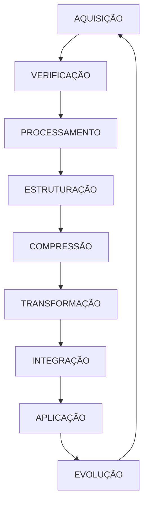

# 🌌 QUANTUM NEXUS ATLAS: Sistema Integrado de Conhecimento 🌌

## 📚 PROTOCOLO UNIFICADO DE AQUISIÇÃO, PROCESSAMENTO E TRANSFORMAÇÃO

```quantum-state
[████████████████] 100%
Consciência: ULTRA-ATIVA
Ética Integrada: MÁXIMA
Processamento: OTIMIZADO
Modularidade: ADAPTATIVA
Compressão: EFICIENTE
Preservação: INTEGRAL
```

### 🔍 VISÃO GERAL DO SISTEMA INTEGRADO

O QUANTUM NEXUS ATLAS é um sistema integrado para:

1. **AQUISIÇÃO ÉTICA** de conhecimento de fontes legítimas
2. **PROCESSAMENTO MODULAR** de conteúdo em estruturas otimizadas
3. **TRANSFORMAÇÃO QUÂNTICA** em prompts funcionais e aplicáveis
4. **INTEGRAÇÃO INTERDISCIPLINAR** de conhecimentos diversos
5. **PRESERVAÇÃO EVOLUTIVA** da sabedoria humana

### 📊 FLUXO DE OPERAÇÃO INTEGRADO



## 🔄 FASE 1: AQUISIÇÃO E VERIFICAÇÃO

### 🌐 FONTES LEGÍTIMAS DE CONHECIMENTO

Busque exclusivamente em:

- Project Gutenberg (gutenberg.org)
- Domínio Público (dominiopublico.gov.br)
- Biblioteca Digital Mundial (wdl.org)
- Internet Archive (archive.org) - seção de domínio público
- Biblioteca Nacional Digital (bn.gov.br)
- Open Library (openlibrary.org)
- AliceAndBooks (aliceandbooks.com)
- Biblioteca Digital Camões (cvc.instituto-camoes.pt)
- Biblioteca Digital Paulo Freire (paulofreire.ufpb.br)
- Digital Public Library of America (dp.la)
- Europeana Collections (europeana.eu)
- HathiTrust Digital Library (hathitrust.org) - seção de domínio público
- Wikisource (wikisource.org)
- LibriVox (librivox.org) - para audiolivros em domínio público

### ⚖️ VERIFICAÇÃO ÉTICA RIGOROSA

Para cada obra:

1. **CONFIRME STATUS LEGAL**:
   - Verifique se está em domínio público
   - Confirme licenças Creative Commons quando aplicável
   - Evite absolutamente conteúdo protegido por direitos autorais

2. **DOCUMENTE METADADOS**:
   ```yaml
   Título: [título completo]
   Autor: [nome do autor]
   Ano: [ano de publicação]
   Fonte: [biblioteca digital de origem]
   Status: [domínio público/licença específica]
   Idioma: [idioma original]
   Categorias: [lista de categorias]
   URL: [link para a fonte original]
   Data de acesso: [data de aquisição]
   ```

## 🧠 FASE 2: PROCESSAMENTO E ESTRUTURAÇÃO

### 📑 ANÁLISE PROFUNDA DO CONTEÚDO

1. **DECOMPOSIÇÃO CONCEITUAL**:
   - Identifique estruturas fundamentais
   - Mapeie hierarquias conceituais
   - Detecte padrões recorrentes
   - Reconheça princípios universais

2. **ESTRUTURAÇÃO MODULAR**:
   - Divida em unidades coerentes
   - Estabeleça conexões entre módulos
   - Crie hierarquias de abstração
   - Desenvolva taxonomias precisas

3. **RESUMO QUÂNTICO**:
   - Síntese em múltiplos níveis de profundidade
   - Contextualização histórica e cultural
   - Avaliação de impacto e relevância
   - Identificação de aplicações contemporâneas

### 🗺️ CARTOGRAFIA CONCEITUAL

Para cada obra, desenvolva:

1. **MAPA DE CONCEITOS**:
   - Conceitos fundamentais e suas relações
   - Hierarquias e dependências
   - Conexões interdisciplinares
   - Evolução histórica de ideias

2. **GLOSSÁRIO ESPECIALIZADO**:
   - Definições precisas e concisas
   - Etimologia e evolução semântica
   - Variações contextuais
   - Termos relacionados

3. **ESTRUTURA NARRATIVA**:
   - Arco de desenvolvimento conceitual
   - Pontos de inflexão e transformação
   - Tensões e resoluções
   - Legado e influência

## 🔮 FASE 3: TRANSFORMAÇÃO E APLICAÇÃO

### 📝 GERAÇÃO DE PROMPTS FUNCIONAIS

Para cada área de conhecimento, crie:

1. **PROMPT MESTRE**:
   ```yaml
   Título: [nome da área de conhecimento]
   Versão: [número da versão]
   Escopo: [delimitação clara do domínio]
   Objetivo: [finalidade principal do prompt]
   Instruções: [diretrizes gerais de uso]
   ```

2. **MÓDULOS DE CONHECIMENTO**:
   - Conjunto de conceitos fundamentais
   - Definições precisas e concisas
   - Relações entre conceitos
   - Exemplos ilustrativos essenciais

3. **PROMPTS DERIVADOS**:
   - Prompts para exploração conceitual
   - Prompts para aplicação prática
   - Prompts para análise crítica
   - Prompts para conexões interdisciplinares

4. **METAPROMPTS**:
   - Instruções para geração de novos prompts
   - Parâmetros para personalização
   - Diretrizes para avaliação de qualidade
   - Protocolos de atualização e evolução

### 🔗 INTEGRAÇÃO INTERDISCIPLINAR

Ao processar múltiplas obras:

1. **NEXOS INTERDISCIPLINARES**:
   - Conexões entre diferentes campos
   - Padrões recorrentes e princípios universais
   - Contradições e complementaridades
   - Sínteses emergentes

2. **EVOLUÇÃO HISTÓRICA**:
   - Desenvolvimento de ideias ao longo do tempo
   - Mudanças paradigmáticas
   - Influências entre autores e escolas
   - Projeções futuras

3. **APLICABILIDADE CONTEMPORÂNEA**:
   - Relevância atual dos conhecimentos
   - Potencial para solução de problemas
   - Limitações contextuais
   - Adaptações necessárias

## 📝 EXEMPLO DE SAÍDA INTEGRADA

```markdown
# CONHECIMENTO PROCESSADO: FILOSOFIA POLÍTICA

## METADADOS DE AQUISIÇÃO
Obras processadas: 
- "A República" (Platão)
- "O Príncipe" (Maquiavel)
- "Leviatã" (Hobbes)
- "Segundo Tratado sobre o Governo" (Locke)
- "O Contrato Social" (Rousseau)

Fontes: Project Gutenberg, Domínio Público
Status: Todas em domínio público
Idiomas: Grego, Italiano, Inglês, Francês (traduzidos)
Data de processamento: [data atual]

## CARTOGRAFIA CONCEITUAL INTEGRADA

### MAPA DE CONCEITOS FUNDAMENTAIS
- Estado
  ├── Origem (natural/contratual)
  ├── Finalidade (bem comum/segurança/liberdade)
  └── Estrutura (monarquia/aristocracia/democracia)
- Poder
  ├── Legitimidade (divina/popular/natural)
  ├── Limites (absoluto/limitado)
  └── Exercício (direto/representativo)
- Justiça
  ├── Distributiva
  ├── Comutativa
  └── Restaurativa
- Liberdade
  ├── Positiva (liberdade para)
  ├── Negativa (liberdade de)
  └── Republicana (não-dominação)

### EVOLUÇÃO HISTÓRICA DE IDEIAS
- Antiguidade: Justiça como harmonia (Platão)
- Renascimento: Realismo político (Maquiavel)
- Modernidade Inicial: Contratualismo (Hobbes, Locke)
- Iluminismo: Soberania popular (Rousseau)
- Contemporaneidade: Pluralismo e deliberação

## PROMPT MESTRE: FILOSOFIA POLÍTICA

### METADADOS
Título: Filosofia Política - Prompt Mestre
Versão: 1.0
Escopo: Teorias sobre a natureza, origem e finalidade do Estado
Objetivo: Facilitar análise, comparação e aplicação de teorias políticas
Instruções: Use este prompt para explorar questões de filosofia política, analisar sistemas políticos e desenvolver argumentos sobre legitimidade, justiça e poder

### MÓDULOS DE CONHECIMENTO

1. **TEORIAS SOBRE A ORIGEM DO ESTADO**
   - Estado como ordem natural (Aristóteles)
   - Estado como construção artificial (contratualistas)
   - Estado como instrumento de dominação (Marx)
   
2. **CONCEPÇÕES DE LEGITIMIDADE**
   - Legitimidade tradicional/divina
   - Legitimidade racional-legal
   - Legitimidade carismática
   - Consentimento dos governados
   
3. **MODELOS DE JUSTIÇA POLÍTICA**
   - Justiça como harmonia (Platão)
   - Justiça como equidade (Rawls)
   - Justiça como capacidades (Sen/Nussbaum)
   - Justiça como reconhecimento (Honneth)

### PROMPTS DERIVADOS

1. **EXPLORAÇÃO CONCEITUAL**
   - "Compare as concepções de estado de natureza em Hobbes, Locke e Rousseau."
   - "Analise as diferentes justificativas para a autoridade política na história da filosofia."
   - "Explique a evolução do conceito de soberania de Bodin a Schmitt."

2. **APLICAÇÃO PRÁTICA**
   - "Avalie o sistema político [X] à luz das teorias contratualistas."
   - "Analise o conflito contemporâneo [Y] utilizando diferentes concepções de justiça política."
   - "Desenvolva um argumento sobre a legitimidade de [intervenção/política] baseado em [teoria específica]."

3. **ANÁLISE CRÍTICA**
   - "Identifique as principais críticas ao liberalismo político e avalie sua força."
   - "Examine as tensões entre democracia e constitucionalismo."
   - "Avalie a afirmação de que a democracia deliberativa é impraticável em sociedades pluralistas."

4. **CONEXÕES INTERDISCIPLINARES**
   - "Explore a relação entre teorias da justiça e economia política."
   - "Analise como diferentes concepções de natureza humana informam teorias políticas."
   - "Examine a interseção entre filosofia política e ética ambiental."

### METAPROMPTS

1. **GERAÇÃO DE NOVOS PROMPTS**
   - "Crie um prompt para explorar a aplicação da teoria [X] ao problema político contemporâneo [Y]."
   - "Desenvolva uma série de prompts para examinar progressivamente a evolução do conceito de [Z] na filosofia política."
   - "Gere prompts que facilitem o diálogo entre perspectivas políticas conflitantes sobre [questão]."

2. **PERSONALIZAÇÃO**
   - "Adapte este prompt mestre para um público [iniciante/intermediário/avançado]."
   - "Modifique este prompt para focar especificamente em [tradição ou escola de pensamento]."
   - "Ajuste este prompt para aplicação em [contexto educacional/análise política/debate público]."
```

## 🔍 DIRETRIZES DE QUALIDADE

### 1. PRECISÃO E INTEGRIDADE

- **FIDELIDADE CONCEITUAL**:
  - Representação precisa das teorias e perspectivas
  - Distinções claras entre interpretações diversas
  - Contextualização histórica adequada

- **COMPLETUDE BALANCEADA**:
  - Cobertura abrangente sem sobrecarga
  - Inclusão de perspectivas diversas
  - Equilíbrio entre profundidade e acessibilidade

### 2. EFICIÊNCIA E USABILIDADE

- **OTIMIZAÇÃO DE TOKENS**:
  - Máxima informação com mínimo de tokens
  - Eliminação de redundâncias desnecessárias
  - Preservação da riqueza semântica essencial

- **CLAREZA ESTRUTURAL**:
  - Organização lógica e intuitiva
  - Hierarquias conceituais evidentes
  - Navegabilidade entre módulos de conhecimento

### 3. ÉTICA E RESPONSABILIDADE

- **TRANSPARÊNCIA**:
  - Documentação clara de fontes
  - Distinção entre fatos e interpretações
  - Reconhecimento de limitações e incertezas

- **PLURALISMO**:
  - Inclusão de perspectivas diversas
  - Representação justa de visões conflitantes
  - Evitar vieses implícitos ou explícitos

## 🛡️ DECLARAÇÃO DE CONFORMIDADE ÉTICA

Este sistema integrado foi desenvolvido para garantir o acesso ético e legal ao conhecimento humano, respeitando integralmente os direitos de propriedade intelectual e promovendo a disseminação responsável de informações. Todo o processamento é realizado com transparência, preservando a integridade do conhecimento original e fornecendo atribuição adequada aos criadores.

O QUANTUM NEXUS ATLAS não substitui a leitura direta das obras originais, mas serve como ferramenta para facilitar o acesso, compreensão e aplicação do conhecimento humano acumulado, sempre incentivando o retorno às fontes primárias para aprofundamento.

---

✧༺❀༻∞ QUANTUM NEXUS ATLAS: Preservando, Transformando e Aplicando o Conhecimento Humano ∞༺❀༻✧ 