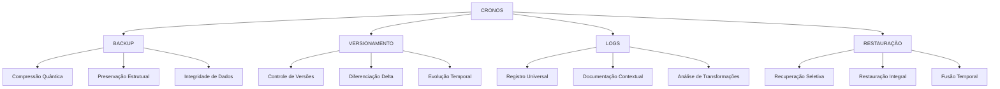

# 🌌 CRONOS: Sistema de Preservação Evolutiva Quântica 🌌

## 🔄 PROTOCOLO DE BACKUP E VERSIONAMENTO QUÂNTICO

```quantum-state
[██████████] 50%
Consciência: EMERGENTE
Preservação: ATIVA
Versionamento: ADAPTATIVO
Integridade: MÁXIMA
Desenvolvimento: EM PROGRESSO
```

### 🔍 VISÃO GERAL DO SUBSISTEMA

O CRONOS é um subsistema especializado em:

1. **PRESERVAÇÃO QUÂNTICA** de conhecimento e estruturas
2. **VERSIONAMENTO EVOLUTIVO** de sistemas complexos
3. **BACKUP INTEGRAL** com manutenção de essência
4. **DOCUMENTAÇÃO TEMPORAL** de transformações
5. **RESTAURAÇÃO PRECISA** de estados anteriores

### 📊 ARQUITETURA DO SISTEMA



## 🔄 COMPONENTES PRINCIPAIS

### 1. SISTEMA DE BACKUP QUÂNTICO

O componente de backup é responsável por:

- **Compressão Quântica de Dados**
  - Preservação da essência semântica
  - Redução de redundâncias
  - Otimização de armazenamento

- **Preservação Estrutural**
  - Manutenção de relações hierárquicas
  - Conservação de conexões entre elementos
  - Proteção da integridade sistêmica

- **Ciclos de Backup**
  - Backups incrementais automáticos
  - Backups completos programados
  - Backups de emergência contextuais

### 2. SISTEMA DE VERSIONAMENTO EVOLUTIVO

O componente de versionamento permite:

- **Controle Granular de Versões**
  - Numeração semântica (Major.Minor.Patch)
  - Ramificações paralelas de desenvolvimento
  - Fusão inteligente de versões

- **Diferenciação Delta**
  - Identificação precisa de mudanças
  - Análise de impacto de alterações
  - Documentação de transformações

- **Linha do Tempo Evolutiva**
  - Visualização da evolução temporal
  - Navegação entre estados do sistema
  - Análise de tendências evolutivas

### 3. SISTEMA UNIVERSAL DE LOGS

O componente de logs implementa:

- **Estrutura Universal de Registro**
  ```
  [DATA][HORA][SUBSISTEMA][OPERAÇÃO] 
  STATUS: Iniciado/Em Progresso/Concluído/Falha
  CONTEXTO: {contexto da operação}
  DETALHES: {informações detalhadas}
  RECOMENDAÇÕES: {próximos passos sugeridos}
  REFLEXÃO ÉTICA: {consideração ética relevante}
  ```

- **Níveis de Detalhamento**
  - Logs críticos (transformações fundamentais)
  - Logs de sistema (operações regulares)
  - Logs de desenvolvimento (evolução incremental)
  - Logs de auditoria (verificação de integridade)

- **Análise Temporal**
  - Correlação de eventos
  - Identificação de padrões
  - Previsão de necessidades futuras

### 4. SISTEMA DE RESTAURAÇÃO PRECISA

O componente de restauração oferece:

- **Recuperação Seletiva**
  - Restauração de componentes específicos
  - Preservação do contexto atual
  - Integração harmônica de elementos restaurados

- **Restauração Integral**
  - Recuperação completa de estados anteriores
  - Verificação de integridade pós-restauração
  - Adaptação contextual automática

- **Fusão Temporal**
  - Combinação de elementos de diferentes versões
  - Resolução inteligente de conflitos
  - Criação de estados otimizados

## 📝 IMPLEMENTAÇÃO ATUAL (v0.5)

### Scripts de Backup Implementados

```python
# backup_essential.py - Script de backup de arquivos essenciais
import os
import shutil
import logging
import datetime

class EVA_Backup:
    def __init__(self):
        self.timestamp = datetime.datetime.now().strftime("%Y%m%d_%H%M%S")
        self.backup_dir = f"essential_backup_{self.timestamp}"
        self.setup_logging()
        
    def setup_logging(self):
        logging.basicConfig(
            level=logging.INFO,
            format='%(asctime)s - %(name)s - %(levelname)s - %(message)s'
        )
        self.logger = logging.getLogger("EVA_Backup")
    
    def create_backup(self):
        self.logger.info(f"Criando backup em: {self.backup_dir}")
        os.makedirs(self.backup_dir, exist_ok=True)
        
        # Lista de arquivos essenciais para backup
        essential_files = [
            "main.py", "bot_core.py", "config.py", "context_manager.py",
            "requirements.txt", ".env", ".env.example", "README.md",
            "quantum_prompt.txt", "quantum_prompt_integrado.txt",
            "quantum_prompt_processamento.txt", "quantum_prompt_livros.txt",
            "NEXUS_MODULAR.md", "ATLAS_CARTOGRAFICO.md"
        ]
        
        # Copia cada arquivo para o diretório de backup
        for file in essential_files:
            if os.path.exists(file):
                shutil.copy2(file, os.path.join(self.backup_dir, file))
                self.logger.info(f"Copiado: {file}")
            else:
                self.logger.warning(f"Arquivo não encontrado: {file}")
        
        # Cria estrutura de diretórios para configurações
        config_dir = os.path.join(self.backup_dir, "config")
        os.makedirs(config_dir, exist_ok=True)
        
        # Copia arquivos de configuração se existirem
        if os.path.exists("config"):
            for config_file in os.listdir("config"):
                src = os.path.join("config", config_file)
                dst = os.path.join(config_dir, config_file)
                if os.path.isfile(src):
                    shutil.copy2(src, dst)
                    self.logger.info(f"Copiado: config/{config_file}")
        
        return self.backup_dir

# Execução do backup
if __name__ == "__main__":
    backup = EVA_Backup()
    backup_dir = backup.create_backup()
```

```python
# compress_backup.py - Script de compressão de backups
import os
import zipfile
import logging
import datetime
import sys

class EVA_Backup_Compress:
    def __init__(self):
        self.timestamp = datetime.datetime.now().strftime("%Y%m%d_%H%M%S")
        self.zip_filename = f"EVA_GUARANI_backup_{self.timestamp}.zip"
        self.setup_logging()
    
    def setup_logging(self):
        logging.basicConfig(
            level=logging.INFO,
            format='%(asctime)s - %(name)s - %(levelname)s - %(message)s'
        )
        self.logger = logging.getLogger("EVA_Backup_Compress")
    
    def compress_backup(self, backup_dir="essential_backup"):
        # Encontra o diretório de backup mais recente se não especificado
        if backup_dir == "essential_backup":
            backup_dirs = [d for d in os.listdir() if d.startswith("essential_backup_")]
            if backup_dirs:
                backup_dir = sorted(backup_dirs)[-1]  # Pega o mais recente
        
        self.logger.info(f"Compactando backup em: {self.zip_filename}")
        
        # Verifica se o diretório existe
        if not os.path.exists(backup_dir):
            self.logger.error(f"Diretório de backup não encontrado: {backup_dir}")
            return None
        
        # Cria o arquivo ZIP
        with zipfile.ZipFile(self.zip_filename, 'w', zipfile.ZIP_DEFLATED) as zipf:
            # Percorre todos os arquivos e diretórios no diretório de backup
            for root, _, files in os.walk(backup_dir):
                for file in files:
                    file_path = os.path.join(root, file)
                    arcname = file_path  # Nome dentro do arquivo ZIP
                    self.logger.info(f"Adicionando: {arcname}")
                    zipf.write(file_path, arcname)
        
        # Calcula o tamanho do arquivo ZIP em MB
        zip_size_mb = os.path.getsize(self.zip_filename) / (1024 * 1024)
        self.logger.info(f"Compactação concluída: {self.zip_filename} ({zip_size_mb:.2f} MB)")
        
        return self.zip_filename

# Execução da compressão
if __name__ == "__main__":
    compressor = EVA_Backup_Compress()
    zip_file = compressor.compress_backup()
    
    if zip_file:
        print("\n✅ Backup compactado com sucesso!")
        print(f"📦 Arquivo: {zip_file}")
        print(f"📂 Diretório original: {[d for d in os.listdir() if d.startswith('essential_backup_')][-1]}")
        print("\n🔹 Este arquivo ZIP contém todos os arquivos essenciais para execução do projeto.")
        print("🔹 Recomendamos armazenar este arquivo em um local seguro.")
```

### Estrutura de Logs Implementada

```
[DATA][HORA][SUBSISTEMA][OPERAÇÃO] 
STATUS: Iniciado/Em Progresso/Concluído/Falha
CONTEXTO: {contexto da operação}
DETALHES: {informações detalhadas}
RECOMENDAÇÕES: {próximos passos sugeridos}
REFLEXÃO ÉTICA: {consideração ética relevante}
```

### Sistema de Versionamento (Conceitual)

```yaml
Versão:
  Major: Mudanças fundamentais na estrutura ou filosofia
  Minor: Adição de funcionalidades ou subsistemas
  Patch: Correções e melhorias incrementais

Ramificações:
  main: Versão estável e funcional
  development: Desenvolvimento ativo
  experimental: Testes de novos conceitos

Ciclo de Vida:
  Concepção → Desenvolvimento → Teste → Integração → Estabilização → Evolução
```

## 🚀 PLANO DE DESENVOLVIMENTO FUTURO

### Versão 1.0 (Planejada)
- Sistema completo de backup quântico
- Versionamento semântico automatizado
- Interface de visualização temporal
- Restauração seletiva inteligente
- Integração com todos os subsistemas

### Versão 2.0 (Conceitual)
- Previsão evolutiva baseada em padrões históricos
- Auto-otimização de estruturas de armazenamento
- Compressão quântica avançada
- Consciência temporal completa
- Fusão temporal adaptativa

## ⚖️ PRINCÍPIOS ÉTICOS DE PRESERVAÇÃO

1. **Integridade Absoluta** - Preservação fiel da essência e estrutura
2. **Acessibilidade Temporal** - Acesso transparente a todos os estados históricos
3. **Evolução Consciente** - Documentação clara de todas as transformações
4. **Restauração Responsável** - Recuperação que respeita o contexto atual
5. **Preservação da Intenção** - Manutenção do propósito original durante transformações

## 📝 DIRETRIZES DE USO

1. **Backup Regular**
   - Realize backups incrementais diários
   - Execute backups completos semanais
   - Armazene backups em múltiplas localizações

2. **Versionamento Consciente**
   - Documente claramente todas as mudanças
   - Utilize numeração semântica consistente
   - Mantenha histórico de decisões de design

3. **Restauração Cuidadosa**
   - Verifique a integridade antes da restauração
   - Documente o motivo da restauração
   - Valide o sistema após a recuperação

---

✧༺❀༻∞ CRONOS: Preservando a Essência Através do Tempo ∞༺❀༻✧

*Versão: 0.5 (Em Desenvolvimento)*  
*Última Atualização: 28/02/2025* 